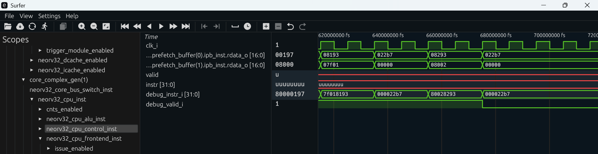
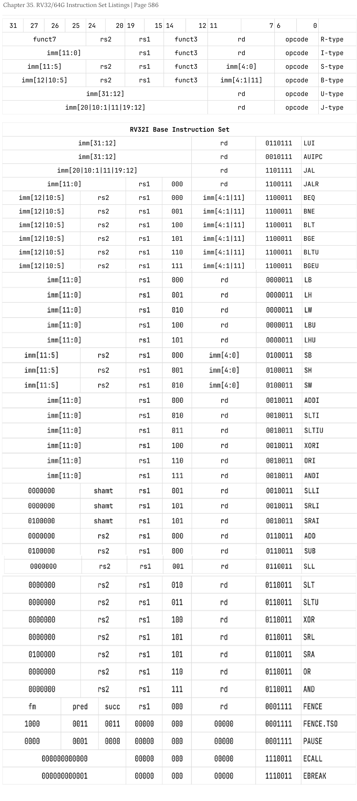
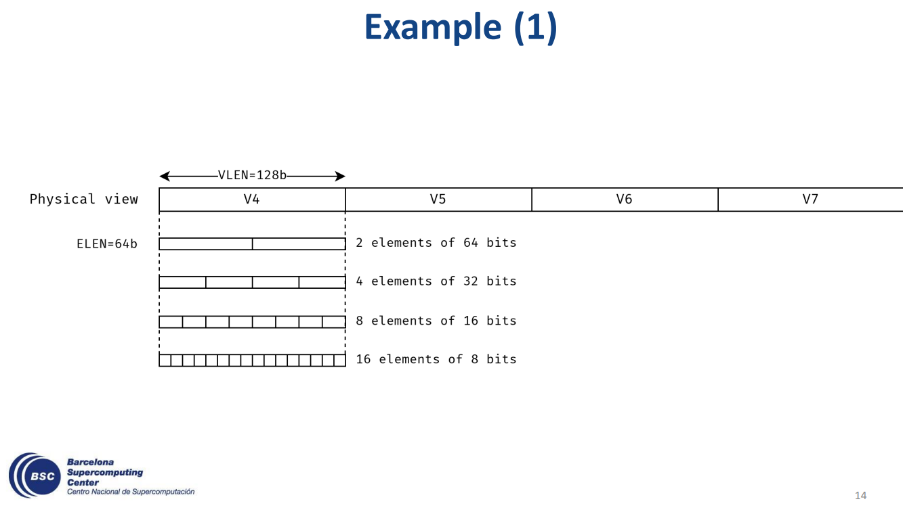
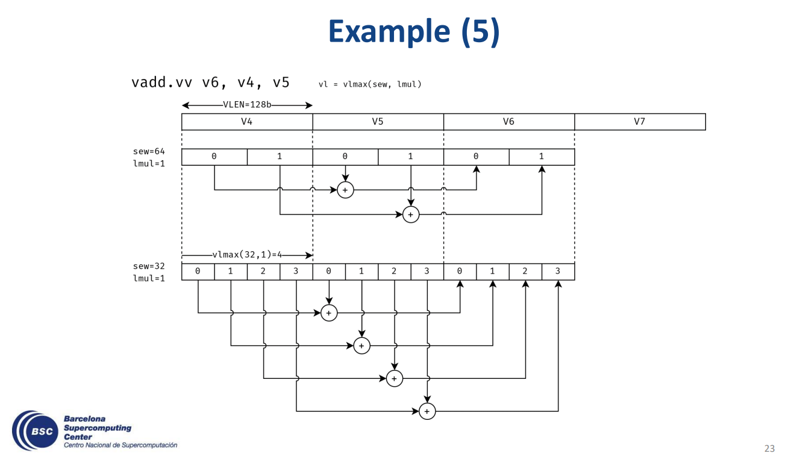

# NEORV32 Documents

Notes and materials on the NEORV32 VHDL CPU
<!--

This TOC extension really works
Auto Markdown TOC  v3.0.15 by Hunter Tran

-->
<!-- -->

<!-- TOC -->

- [NEORV32 Documents](#neorv32-documents)
- [Credit](#credit)
- [Links](#links)
- [Tips](#tips)
- [Simulation](#simulation)
- [Execution Engine](#execution-engine)
- [Finding executed instructions](#finding-executed-instructions)
- [Tipps for Debugging using .vcd trace files](#tipps-for-debugging-using-vcd-trace-files)
    - [Finding the Simulation Time when an Instruction is executed](#finding-the-simulation-time-when-an-instruction-is-executed)
    - [Comparing two .vcd files](#comparing-two-vcd-files)
    - [Printing Strings and Object](#printing-strings-and-object)
- [Adding custom instructions](#adding-custom-instructions)
    - [Select the Mnemonic](#select-the-mnemonic)
    - [Select the Encoding](#select-the-encoding)
    - [Extending the Execution Engine Microcode](#extending-the-execution-engine-microcode)
- [Writing an application that uses the new instruction](#writing-an-application-that-uses-the-new-instruction)
    - [Strategies for Writing Applications](#strategies-for-writing-applications)
    - [The Standard Approach using a Toolchain and Makefiles](#the-standard-approach-using-a-toolchain-and-makefiles)
    - [Setup the toolchain and the build environment](#setup-the-toolchain-and-the-build-environment)
    - [Compiling](#compiling)
    - [Analysing the Assembly Listing](#analysing-the-assembly-listing)
    - [Initializing the C-runtime](#initializing-the-c-runtime)
    - [Dealing with global variable](#dealing-with-global-variable)
    - [Symmetric Multi Processing, Hart 0 Check](#symmetric-multi-processing-hart-0-check)
    - [Summary](#summary)
    - [Write a simple main function](#write-a-simple-main-function)
    - [Editing the Main Function](#editing-the-main-function)
    - [Inline Assembly](#inline-assembly)
        - [String Concatenation](#string-concatenation)
        - [Replacing Placeholders](#replacing-placeholders)
        - [In- and out-parameters](#in--and-out-parameters)
        - [Usage](#usage)
- [The bootloader](#the-bootloader)
- [CFU vs. CFS - Extending the NEORV32 CPU](#cfu-vs-cfs---extending-the-neorv32-cpu)
    - [Extending the NEORV32 via the Custom Functions Unit CFU](#extending-the-neorv32-via-the-custom-functions-unit-cfu)
        - [Merge/Pull Request that added the CFU](#mergepull-request-that-added-the-cfu)
        - [Questions](#questions)
    - [Extending the NEORV32 via the Custom Functions Subsystem CFS](#extending-the-neorv32-via-the-custom-functions-subsystem-cfs)
        - [The interface of CFS](#the-interface-of-cfs)
        - [Bus Requests / Responses](#bus-requests--responses)
        - [Writing Software that uses CFS](#writing-software-that-uses-cfs)
        - [The example](#the-example)
- [The FPU Zfinx](#the-fpu-zfinx)
    - [Triggering the FPU](#triggering-the-fpu)
- [Loading data from Memory into Registers](#loading-data-from-memory-into-registers)
    - [Execution Engine States for Memory Access](#execution-engine-states-for-memory-access)
    - [RAM IMEM and DMEM](#ram-imem-and-dmem)
    - [Load Store Unit LSU](#load-store-unit-lsu)
- [Extending NEORV32 by the Vector V Extension](#extending-neorv32-by-the-vector-v-extension)
    - [V Extension Hardware Additions](#v-extension-hardware-additions)
    - [New Registers](#new-registers)
    - [Configuring the Vector-Engine](#configuring-the-vector-engine)
    - [Loading data](#loading-data)
    - [Performing a vector operation](#performing-a-vector-operation)
    - [Performing a save operation](#performing-a-save-operation)
    - [Strip-Mining example](#strip-mining-example)
- [Extending NEORV32 with a Matrix Extension](#extending-neorv32-with-a-matrix-extension)
    - [Opcodes](#opcodes)
    - [Matrix Dimensions](#matrix-dimensions)
    - [Adding matrix registers](#adding-matrix-registers)
        - [Analysing the X Register File for RV32 instructions](#analysing-the-x-register-file-for-rv32-instructions)
- [Cache Bus Host](#cache-bus-host)
- [Burst Transfers for Bus Hosts](#burst-transfers-for-bus-hosts)
- [DMA](#dma)

<!-- /TOC -->


# Credit

All credit goes to Stephan Nolting. All the ideas stem from his designs.
I salute his ingenuity and creativity.

# Links

https://stnolting.github.io/neorv32/

# Tips

In VSCode, adding

```
#warning-ignore-all
```

to the top of a VHDL (or any) file will turn of error-squigglies
which makes it easier to read the file in case the linter is not
able to resolve all symbols correctly.

# Simulation

https://stnolting.github.io/neorv32/ug/#_simulating_the_processor
https://stnolting.github.io/neorv32/ug/#_ghdl_simulation

Install Msys2. Inside the Msys2 console, install GHDL.

```
cd /c/Users/lapto/dev/VHDL/neorv32/sim
sh ghdl.sh --stop-time=20us --vcd=neorv32.vcd
```

```
sh ghdl.sh --stop-time=20ms --vcd=neorv32.vcd
sh ghdl.sh --stop-time=20ns --vcd=neorv32.vcd
```

The shell script will compile (analyse, evaluate with GHDL) the processor and start a simulation.

The CPU is simulated for the real-time period specified via the --stop-time parameter. The simulation takes much longer in real world time than the specified time period to simulate the design for. It is probably smart to first try with a simulation duration of 20us instead of 20ms. 20ns is not enough to get the CPU to process relevant data.

The signal traces go into the waveform file sim\neorv32.vcd which you can open and analyze in GTKWave, Surfer or other waveform viewers.

To start surfer, install rust and build it using cargo

```
git clone https://gitlab.com/surfer-project/surfer.git
cd C:\Users\lapto\dev\rust\surfer\surfer
cargo build
cargo run
```

# Execution Engine

The NEORV32 processor is separated into a frontend and a backend.
The frontend fetches instructions while the backend executes them.
Both units can work somewhat independently from each other and are
loosly coupled by a queue. This allows the frontend to fetch several
instructions without waiting for the backend.

The backend is a mixture of a pipelined architecture with separate
phases (FETCH, DECODE, EXECUTE, MEM_ACCESS, WRITE_BACK) and a
micro-code architecture.

The instruction from the frontend enters the execution engine during
the EX_DISPATCH microcode step. The exe_engine_nxt signal is used
to store the instruction. Also the Program Counter (PC) is updated.

```VHDL
exe_engine_nxt.ir    <= frontend_i.instr;                         -- instruction word
exe_engine_nxt.pc    <= exe_engine.pc2(XLEN-1 downto 1) & '0';    -- PC <= next PC
```

Sadly when simulating the design, the generated .vcd file will not
contain the internal signals which carry the instruction! This makes
it hard to debug what instructions the CPU executes during simulation.

# Finding executed instructions

Using only a GHDL simulation and a waveform viewer, it is hard to
figure out, which instructions are executed. The reason is that
the frontend will perform instruction fetches which are to a degree
independant from the instructions that the backend will execute.
The frontend has two instruction prefetch buffers.

The backend will execute instructions in the order in which the
assembly code orders them, there is no reordering. The instructions
enter the backend via the a structure called 'frontend'. I have not
yet understood how a simulator such as GHDL decides, which signals
it will write to the .vcd file and which are hidden. The frontend
structure is not written into the .vcd file.

To trace the instructions, as a debug measure, it is possible to add
artificial signals into the design strictly so that GHDL writes
them to the .vcd file.

Making these changes:

*rtl\core\neorv32_cpu.vhd*

```VHDL
  -- Control Unit (Back-End / Instruction Execution) ----------------------------------------
  -- -------------------------------------------------------------------------------------------
  neorv32_cpu_control_inst: entity neorv32.neorv32_cpu_control
    generic map (
        ...
    )
    port map (

        ...

        -- [debug] - make instruction visible
        debug_valid_i   => frontend.valid,       -- bus signals are valid
        debug_instr_i   => frontend.instr,       -- instruction

        ...

    );
```

*rtl\core\neorv32_cpu_control.vhd*

```VHDL
entity neorv32_cpu_control is
    generic (
        ...
    );
    port (

        ...

        -- [debug] - make instruction visible
        debug_valid_i   : in std_ulogic;                          -- bus signals are valid
        debug_instr_i   : in std_ulogic_vector(31 downto 0);      -- instruction

        ...

    );
end neorv32_cpu_control;
```

GHDL will output the following trace:



REMARK: The surfer trace viewer (https://surfer-project.org/) is used
in the image above.

This trace shows that the frontend prefetches instructions in non-intuitive
ways. For example the compressed instruction 0x00002b27 is fetched, then
0x80028293 is fetched and then 0x00002b27 is fetched again!

The execution engine is displayed in the lower traces thanks to the
debug-signals inserted above.

The following traces are of interest

```
core_complex_gen(0) > neorv32_cpu_inst > neorv32_cpu_alu_inst > debug_alu_op
core_complex_gen(0) > neorv32_cpu_inst > neorv32_cpu_control_inst > debug_instr_i
core_complex_gen(0) > neorv32_cpu_inst > neorv32_cpu_control_inst > debug_valid_i
```

The *debug_instr* trace contains the instruction that the execution engine
sees and the *debug_valid* trace dictates if the execution engine is triggered
to consume the instruction. If the valid signal is low, the execution engine
ignores the instruction.

The execution engine traces show which instructions are executed by the CPU.
For example the second fetch of the compressed instruction 0x00002b27 is ignored
by the execution engine as the *debug_valid* signal is low.

# Tipps for Debugging using .vcd trace files

## Finding the Simulation Time when an Instruction is executed

In the case you want to find out, when an instruction is executed for the first time and you happen to have identified a signal that carries instruction, meaning you do have a signal in the .vcd file that will actually show the instruction.

In that case, convert the instruction to binary, and look for the binary value in the .vcd file.

For example, the instruction 0x000797F7 has the binary pattern 01111001011111110111. Now look for the binary pattern in the .vcd file. Scroll up at the first find until you encounter the timestamp.

```
#8090000000
```

Now scroll to this timestamp in the waveform viewer.

The ALU_A input signal is called neorv32_tb.neorv32_top_inst.core_complex_gen(0).neorv32_cpu_inst.rs1
The ALU_B input signal is called neorv32_tb.neorv32_top_inst.core_complex_gen(0).neorv32_cpu_inst.rs2

The register file is defined in rtl\core\neorv32_cpu_regfile.vhd. The entity is called neorv32_cpu_regfile. It is instantiated as a child of the neorv32_cpu entity.

The register file contains the signal neorv32_tb.neorv32_top_inst.core_complex_gen(0).neorv32_cpu_inst.neorv32_cpu_regfile_inst.rd_i. This is where loaded

## Comparing two .vcd files

Sometimes, it is a good idea to copy a section of existing code to use as a starting point for an extension of the functionality. When copying a portion of the code, the likelyhood that other changes should be copied and adjusted too are high.

An example is to extend the system by another variant of lb, lh, lw and ld. In order to achieve this, code for the execution engine state EX_MEM_REQ and EX_MEM_RSP can be copied to new states. When introducing a new instruction for load operations from memory into to the register file, it is not enough to just copy execution engine states and make the state machine transition into those new states, also signals that are placed on the bus need to be copied. Another required change is to tell the execution engine to place a signal on the bus which causes the Load-Store-Unit (LSU) to enable writeback when it has entered the newly copied states:

A change from

```
ctrl_o.lsu_mo_we    <= '1' when (exe_engine.state = EX_MEM_REQ) else '0'; -- write memory output registers (data & address)
```

to

```
ctrl_o.lsu_mo_we    <= '1' when (exe_engine.state = EX_MEM_REQ or exe_engine.state = EX_MATRIX_MEM_REQ) else '0'; -- write memory output registers (data & address)
```

is required.

If you do not know this then no value is loaded into the register file, since the register file is not enabled to read results back.

In order to identify this problem, run the simulation using a normal, working lb, lh, lw, ld command and store the .vcd file aside. Then run the simulation again with the newly updated instruction that does not work. Store the other .vcd file aside.

Now, open two instances of the surfer trace viewer and check the signals side-by-side. This takes a little bit of time especially since you have to add signals until you find the signals that differ in boths .vcd files. But eventually you will identify the missing signal. In the example above, the difference is the value of the lsu_mo_we signal which is the write enable for the register file.

This is in a sense a type of tool assisted debugging. Instead of just pondering about the code in the editor you visually compare images on the screen which is a task our brain excells in. Reasoning about code is far more difficult than the task of comparing images, especially as you need to keep a lot of context about the code in your memory when reading code. Comparing images is a local task which does not require a lot of context.

## Printing Strings and Object

It is possible to print text to the console during simulation. Obviously, this feature is not part of the synthesisable subset of VHDL. The GHDL evaluator and simulator support this feature.

First, import the std.textio package and define a variable of type line, to store a string. You need to define variables in the defintion section of a process:

```
use std.textio.all;

process(...)
    variable l : line;
begin
    ...
end
```

Then, inside the process body, transfer data into the line variable and print the line variable in a second step using writeline()

```
use std.textio.all;

process(...)
    variable l : line;
begin

    ...

    -- DEBUG
    write(l, String'("EX_MEM_REQ"));
    writeline(output, l);

    ...

end
```

It is not possible to achieve this in a single line.

write() is able to format objects to a string representation. This allows you to output vectors for example:

```
write(l, trap_ctrl.exc_buf);
writeline(output, l);
```


# Adding custom instructions

Lets add a custom instruction to the NEORV32 RISC-V CPU.

##  1. <a name='SelecttheMnemonic'></a>Select the Mnemonic

The RV32I instructions and their encoding is defined on page 586 of the unprivileged
RISC-V specification.



Lets mimic the add instruction and instead of adding two registers, add the
first register value to the second register value and on top of that add the
constant value 1 to the result.

Lets mimic the add instruction and instead of adding two registers, add the
first register to itself.

Or count the number of bits that are set to 1 in an immediate and return that
count into the target register.

```
add1 rd, rs1, rs2
```

add1 will perform the operation

```
rd = rs1 + rs2 + 1
```

##  2. <a name='SelecttheEncoding'></a>Select the Encoding

The encoding of add is R-Type because it is a register (R) instruction.

| component | value | remark |
| --------- | ----- | -------------- |
| opcode    | 0b0110011 | lowest two bits are 11 because this is not a compressed instruction |
| funct7    | 0b0000000 | |
| funct3    | 0b000 | |

The opcode 0b0110011 is defined to be an ALU-operation within the NEORV32 source code.

*rtl\core\neorv32_package.vhd*

```VHDL
constant opcode_alu_c    : std_ulogic_vector(6 downto 0) := "0110011"; -- ALU operation
```

In general, func3 is used to control the operation that the ALU will perform. The ALU can
add and subtract (whereas subtraction is an addition with an sign-inverted/negated operand),
shift left or right, XOR, OR and AND.

Amongst the ALU operations, a func3 value of 0b000 is defined to be a sub or a add ALU-operation.

```VHDL
constant funct3_sadd_c   : std_ulogic_vector(2 downto 0) := "000"; -- sub/add
```

Which leaves us with funct7 for adding codes for custom instructions.

funct7 of 0b0000000 is used for add. funct7 of 0b0100000 is used for sub.

Note that the second highest bit is what activates subtraction inside the NEORV32 execution engine:

*rtl\core\neorv32_cpu_control.vhd*
```VHDL
-- addition/subtraction control --
if (funct3_v(2 downto 1) = funct3_slt_c(2 downto 1)) or -- SLT(I), SLTU(I)
    ((funct3_v = funct3_sadd_c) and (opcode(5) = '1') and (exe_engine.ir(instr_funct7_msb_c-1) = '1')) then -- SUB
    ctrl_nxt.alu_sub <= '1';
end if;
```

This means, any funct7 with the scond highest bit set is not of use for the add1 instruction.

Let's use funct7 of 0b1000000 for add1.

##  3. <a name='ExtendingtheExecutionEngineMicrocode'></a>Extending the Execution Engine Microcode

Next, since the Execution Engine checks instructions before executing them, we need to add the add1 instruction to the check.

*rtl\core\neorv32_cpu_control.vhd*

```VHDL
-- is base rv32i/e ALU[I] instruction (excluding shifts)? --
if ((opcode(5) = '0') and (funct3_v /= funct3_sll_c) and (funct3_v /= funct3_sr_c)) or -- base ALUI instruction (excluding SLLI, SRLI, SRAI)
    ((opcode(5) = '1') and (((funct3_v = funct3_sadd_c) and (funct7_v = "0000000")) or -- add
                            ((funct3_v = funct3_sadd_c) and (funct7_v = "0100000")) or -- sub
                            ((funct3_v = funct3_sadd_c) and (funct7_v = "1000000")) or -- add1
                            ((funct3_v = funct3_slt_c)  and (funct7_v = "0000000")) or
                            ((funct3_v = funct3_sltu_c) and (funct7_v = "0000000")) or
                            ((funct3_v = funct3_xor_c)  and (funct7_v = "0000000")) or
                            ((funct3_v = funct3_or_c)   and (funct7_v = "0000000")) or
                            ((funct3_v = funct3_and_c)  and (funct7_v = "0000000")))) then -- base ALU instruction (excluding SLL, SRL, SRA)
    ctrl_nxt.rf_wb_en    <= '1'; -- valid RF write-back (won't happen if exception)
    exe_engine_nxt.state <= EX_DISPATCH;
else -- [NOTE] illegal ALU[I] instructions are handled as multi-cycle operations that will time-out as no ALU co-processor responds
    ctrl_nxt.alu_cp_alu  <= '1'; -- trigger ALU[I] opcode-space co-processor
    exe_engine_nxt.state <= EX_ALU_WAIT;
end if;
```

In the listing above, a line for the add1 instruction has been added to the check.

TODO: changes for add1
TODO: changes for debugging alu operations and alu_inc

# Writing an application that uses the new instruction

Next, we need to create machine code that we can copy into rtl\core\neorv32_application_image.vhd
because this is the ROM that is synthesized into the NEORV32 CPU for simulating and the NEORV32
processor will execute the code stored in this ROM when the simulation starts.

##  4. <a name='StrategiesforWritingApplications'></a>Strategies for Writing Applications

In order to create machine code, there is a quick and dirty way and a standard approach.

The quick and dirty way is to assemble your machine code by hand according to the RISC-V encoding
defined in the RISC-V non priviledged specification. Then paste you machine code into
rtl\core\neorv32_application_image.vhd

##  5. <a name='TheStandardApproachusingaToolchainandMakefiles'></a>The Standard Approach using a Toolchain and Makefiles

The standard approach is to follow the structure outlined in the examples located inside the
sw\example folder.

The examples use a Makefile in each of the example folders which sets flags and then includes
the common Makefile which is used for all examples. The common makefile is sw\common\common.mk

Inside the common.mk makefile, all the targets are defined. A target is a certain function that
you can execute using the build system. One target is the 'all' target which performs all build
steps. You trigger a target by adding it as a parameter to the make command.

```
make all
```

The makefiles uses the RISC-V GNU GCC toolchain to build machine code. A toolchain
is a term for a set of tools that you can use for compiling higher languages into assemly (gcc)
and for turning the assembly into machine code (as). Also tools that decompile output files back to
assembly are available (objdump). The toolchain contains a plethora of tools that I have never even
used yet! It is worthwhile to familiarize yourself with the applications available inside the
toolchain's bin folder to become a better developer if you are interested in open source development.

The RISC-V GNU GCC toolchain that we will be using is going to be a toolchain for cross compiling.
Cross compiling is when the toolchain outputs machine code that the system on which the tools are
executed, cannot run. Instead we use one computer system to write code for another computer system.

In our case, you will most likely (we assume) be working on a x86 or a ARM
system. Your target is RISC-V for the NEORV32. With that, you are going to need a cross compiler
toolchain. FYI, native toolchains produce machine code for the architecture that also runs the
toolchain itself.

##  6. <a name='Setupthetoolchainandthebuildenvironment'></a>Setup the toolchain and the build environment

The NEORV32 repository does not come with the cross compiler toolchain prepackaged. Therefore download a
precompiled gcc toolchain from https://xpack-dev-tools.github.io/riscv-none-elf-gcc-xpack/
more precicesly from the release page of the xpack project: https://github.com/xpack-dev-tools/riscv-none-elf-gcc-xpack/releases

Next, install Msys2 if you have not already and open a Msys2 64 bit console.
Inside the console, export the *NEORV32_HOME* environment variable.

```
NEORV32_HOME=/C/Users/lapto/dev/VHDL/neorv32
```

Adjust the paths to your local situation. Copy and pasting my paths from this tutorial without
adjustments would be a mistake!

Also add the toolchain's bin folder to the PATH environment variable

```
PATH=/c/Users/lapto/Downloads/xpack-riscv-none-elf-gcc-14.2.0-3-win32-x64/xpack-riscv-none-elf-gcc-14.2.0-3/bin:$PATH
```

Enter one of the software example folders.

```
cd /c/Users/lapto/dev/VHDL/neorv32/sw/example/demo_cfu
```

Next let the makefile check if the cross compiling toolchain is setup correctly.
To do this, execute the check target.

```
make check
```

The output should be 'Toolchain check OK'. The check target will also compile the
image_gen tool. The image_gen tool produces new neorv32_application_image.vhd files.

The next step will be to compile the example.

##  7. <a name='Compiling'></a>Compiling

```
make all
```

The 'all' target creates the machine code, stores the machine code into several file
formats. It also generates a new neorv32_application_image.vhd and copies it
into the VHDL source code folder so you can immedately start a simulation with the
new code.

```
$ make all
Memory utilization:
   text    data     bss     dec     hex filename
   6324       0    1292    7616    1dc0 main.elf
Generating neorv32_exe.bin
Executable size in bytes:
6336
Generating neorv32_raw_exe.hex
Generating neorv32_raw_exe.bin
Generating neorv32_raw_exe.coe
Generating neorv32_raw_exe.mem
Generating neorv32_raw_exe.mif
Generating neorv32_application_image.vhd
Installing application image to ../../../rtl/core/neorv32_application_image.vhd
```

One important output file is the .elf file. .elf stands for executable and linkable format.
.elf files may contain executable applications and also libraries that can be
linked to become part of applications. .elf is used by Linux to transfer machine code
from the harddrive into RAM for execution in a new process. The respective file format
on windows would be the PE file format. The GCC toolchain cannot create PE files.

NEORV32 does not use the .elf file but the cross compile toolchain contains the
objdump tool which extracts RISC-V assembly code from the .elf file. This is important
for use here since the original source code of the example is written in C but we
want to analyze the application in assembly code in the following.

Convert the .elf file into an assembly listing:
Open a Msys2 64 bit console.
Enter one of the example folders:

```
cd /c/Users/lapto/dev/VHDL/neorv32/sw/example/demo_cfu
```

```
PATH=/c/Users/lapto/Downloads/xpack-riscv-none-elf-gcc-14.2.0-3-win32-x64/xpack-riscv-none-elf-gcc-14.2.0-3/bin:$PATH
riscv-none-elf-objdump --disassemble main.elf > main.asm
```

##  8. <a name='AnalysingtheAssemblyListing'></a>Analysing the Assembly Listing

The assembly listing is ridiculously large. The most important function is the
main function because it contains the actual source code that the user has written
using the C programming language. Basically this is the payload that the user is
interested in.

```
00000334 <main>:
     334:	fc010113          	addi	sp,sp,-64
     338:	02112e23          	sw	ra,60(sp)
     33c:	02812c23          	sw	s0,56(sp)
     340:	02912a23          	sw	s1,52(sp)
     344:	03212823          	sw	s2,48(sp)
     348:	03312623          	sw	s3,44(sp)
     34c:	03412423          	sw	s4,40(sp)
     350:	03512223          	sw	s5,36(sp)
     354:	03612023          	sw	s6,32(sp)
     358:	091000ef          	jal	be8 <neorv32_rte_setup>
     35c:	fff50537          	lui	a0,0xfff50
     360:	0f1000ef          	jal	c50 <neorv32_uart_available>
     364:	1e050463          	beqz	a0,54c <main+0x218>
     368:	000055b7          	lui	a1,0x5
     36c:	00000613          	li	a2,0
     370:	b0058593          	addi	a1,a1,-1280 # 4b00 <__neorv32_rom_size+0xb00>
     374:	fff50537          	lui	a0,0xfff50
     378:	115000ef          	jal	c8c <neorv32_uart_setup>
     37c:	000015b7          	lui	a1,0x1
     380:	34058593          	addi	a1,a1,832 # 1340 <__fini_array_end>
     384:	fff50537          	lui	a0,0xfff50
     388:	419000ef          	jal	fa0 <neorv32_uart_printf>
     38c:	000015b7          	lui	a1,0x1

     ...
```

The main function is not the first set of instructions that are executed!
Instead, the application starts with initializing the C-runtime first.

The instructions mainly come from the code that the toolchain generates for the
C-programming language. C has a C-runtime which is a set all functions that solve
common problems such as strlen() but also acts as a layer that ports the C language
to a target by implementing memory handling through malloc() and free() for example.

Some of the C-runtime functions are provided by the compiler which means it is
provided by the gcc cross compiler toolchain. To initialize the C-runtime, a assembly
file from the NEORV32 repostory is used. This means this file is not part of the
cross compiler toolchain! You can see that the entire software system is rather complex.

In order for this layer of C-runtime to work, it needs to be initialized. This means
that some sections of RAM are filled with certain values so that all variable used
by the C-runtimes have valid values. Before main() is executed, the application starts
with the initialization of the C-runtime, then jumps to the main() function.

crt stands for C-runtime.

##  9. <a name='InitializingtheC-runtime'></a>Initializing the C-runtime

Let's look at the disassembly for the C runtime initialization.

```

main.elf:     file format elf32-littleriscv


Disassembly of section .text:

00000000 <__crt0_entry>:
       0:	f14020f3          	csrr	ra,mhartid
       4:	80002217          	auipc	tp,0x80002
       8:	ffb20213          	addi	tp,tp,-5 # 80001fff <__crt0_ram_last>
       c:	ff027113          	andi	sp,tp,-16
      10:	80000197          	auipc	gp,0x80000
      14:	7f018193          	addi	gp,gp,2032 # 80000800 <__global_pointer>
      18:	000022b7          	lui	t0,0x2
      1c:	80028293          	addi	t0,t0,-2048 # 1800 <_ctype_+0x50>
      20:	30029073          	csrw	mstatus,t0
      24:	00000317          	auipc	t1,0x0
      28:	18030313          	addi	t1,t1,384 # 1a4 <__crt0_trap>
      2c:	30531073          	csrw	mtvec,t1
      30:	30401073          	csrw	mie,zero
      34:	00002397          	auipc	t2,0x2
      38:	88038393          	addi	t2,t2,-1920 # 18b4 <__crt0_copy_data_src_begin>
      3c:	80000417          	auipc	s0,0x80000
      40:	fc440413          	addi	s0,s0,-60 # 80000000 <time_dec_sw>
      44:	80000497          	auipc	s1,0x80000
      48:	fbc48493          	addi	s1,s1,-68 # 80000000 <time_dec_sw>
      4c:	80000517          	auipc	a0,0x80000
      50:	fb450513          	addi	a0,a0,-76 # 80000000 <time_dec_sw>
      54:	80000597          	auipc	a1,0x80000
      58:	4b858593          	addi	a1,a1,1208 # 8000050c <__crt0_bss_end>
      5c:	00000613          	li	a2,0
      60:	00000693          	li	a3,0
      64:	00000713          	li	a4,0
      68:	00000793          	li	a5,0
      6c:	00000813          	li	a6,0
      70:	00000893          	li	a7,0
      74:	00000913          	li	s2,0
      78:	00000993          	li	s3,0
      7c:	00000a13          	li	s4,0
      80:	00000a93          	li	s5,0
      84:	00000b13          	li	s6,0
      88:	00000b93          	li	s7,0
      8c:	00000c13          	li	s8,0
      90:	00000c93          	li	s9,0
      94:	00000d13          	li	s10,0
      98:	00000d93          	li	s11,0
      9c:	00000e13          	li	t3,0
      a0:	00000e93          	li	t4,0
      a4:	00000f13          	li	t5,0
      a8:	00000f93          	li	t6,0

000000ac <__crt0_smp_check>:
      ac:	02008a63          	beqz	ra,e0 <__crt0_smp_primary>
      b0:	00000797          	auipc	a5,0x0
      b4:	01878793          	addi	a5,a5,24 # c8 <__crt0_smp_wakeup>
      b8:	30579073          	csrw	mtvec,a5
      bc:	30446073          	csrsi	mie,8
      c0:	30046073          	csrsi	mstatus,8
      c4:	0d80006f          	j	19c <__crt0_sleep>

000000c8 <__crt0_smp_wakeup>:
      c8:	fff44737          	lui	a4,0xfff44
      cc:	00872103          	lw	sp,8(a4) # fff44008 <__crt0_ram_last+0x7ff42009>
      d0:	00c72603          	lw	a2,12(a4)
      d4:	fff40737          	lui	a4,0xfff40
      d8:	00072223          	sw	zero,4(a4) # fff40004 <__crt0_ram_last+0x7ff3e005>
      dc:	05c0006f          	j	138 <__crt0_main_entry>

000000e0 <__crt0_smp_primary>:
      e0:	00838e63          	beq	t2,s0,fc <__crt0_bss_clear>

000000e4 <__crt0_data_copy>:
      e4:	00945c63          	bge	s0,s1,fc <__crt0_bss_clear>
      e8:	0003a783          	lw	a5,0(t2)
      ec:	00f42023          	sw	a5,0(s0)
      f0:	00438393          	addi	t2,t2,4
      f4:	00440413          	addi	s0,s0,4
      f8:	fedff06f          	j	e4 <__crt0_data_copy>

000000fc <__crt0_bss_clear>:
      fc:	00b55863          	bge	a0,a1,10c <__crt0_bss_clear_end>
     100:	00052023          	sw	zero,0(a0)
     104:	00450513          	addi	a0,a0,4
     108:	ff5ff06f          	j	fc <__crt0_bss_clear>

0000010c <__crt0_bss_clear_end>:
     10c:	00001417          	auipc	s0,0x1
     110:	23440413          	addi	s0,s0,564 # 1340 <__fini_array_end>
     114:	00001497          	auipc	s1,0x1
     118:	22c48493          	addi	s1,s1,556 # 1340 <__fini_array_end>

0000011c <__crt0_constructors>:
     11c:	00945a63          	bge	s0,s1,130 <__crt0_constructors_end>
     120:	00042083          	lw	ra,0(s0)
     124:	000080e7          	jalr	ra
     128:	00440413          	addi	s0,s0,4
     12c:	ff1ff06f          	j	11c <__crt0_constructors>

00000130 <__crt0_constructors_end>:
     130:	00000617          	auipc	a2,0x0
     134:	20460613          	addi	a2,a2,516 # 334 <main>

00000138 <__crt0_main_entry>:
     138:	80000197          	auipc	gp,0x80000
     13c:	6c818193          	addi	gp,gp,1736 # 80000800 <__global_pointer>
     140:	0ff0000f          	fence
     144:	0000100f          	fence.i
     148:	30029073          	csrw	mstatus,t0
     14c:	00000513          	li	a0,0
     150:	00000593          	li	a1,0
     154:	000600e7          	jalr	a2

00000158 <__crt0_main_exit>:
     158:	30401073          	csrw	mie,zero
     15c:	34051073          	csrw	mscratch,a0
     160:	00000517          	auipc	a0,0x0
     164:	04450513          	addi	a0,a0,68 # 1a4 <__crt0_trap>
     168:	30551073          	csrw	mtvec,a0
     16c:	f1402473          	csrr	s0,mhartid
     170:	02041463          	bnez	s0,198 <__crt0_destructors_end>
     174:	00001417          	auipc	s0,0x1
     178:	1cc40413          	addi	s0,s0,460 # 1340 <__fini_array_end>
     17c:	00001497          	auipc	s1,0x1
     180:	1c448493          	addi	s1,s1,452 # 1340 <__fini_array_end>
```

Disclaimer: I do not pretend to understand exactly what is happening here in all detail.

Let's check the most important parts.

Firstly, when the C-runtime is done initializing, it calls the main() function.

```
154:	000600e7          	jalr	a2
```

The register a2 has been loaded with the address of the main() function a few
lines earlier.

```
00000130 <__crt0_constructors_end>:
     130:	00000617          	auipc	a2,0x0
     134:	20460613          	addi	a2,a2,516 # 334 <main>
```

At the very beginning, at address 0x00000000, we find the code contained in
the sw\common\crt0.S file. crt stands for C-runtime. This means this assembly
file contains all the C-runtime initialization. Remark: This file is provided
by the NEORV32 repository and not by the cross compiler toolchain for some reason.

This means that the crt0.s file is linked into the executable at the beginning
of the address space.

It is easier to read the original assembly code than to read the disassembled
assembly because the original source file contains human readable symbols and
comments. So let's look at the crt0.s instead of the disassembly listing.

Here is a excerpt from sw\common\crt0.S

```
// ************************************************************************************************
// Register setup.
// ************************************************************************************************
.option push
.option norelax
  csrr  x1, mhartid                     // get ID of this core

  la    x4, __crt0_ram_last             // last address of RAM, stack pointer (sp) starts here
  andi  x2, x4, 0xfffffff0              // align stack to 16-bytes according to the RISC-V ABI (#1021)
  la    x3, __global_pointer            // global pointer "gp"

  li    x5, 0x00001800                  // mstatus.mpp = machine-mode
  csrw  mstatus, x5
  la    x6, __crt0_trap                 // configure early-boot trap handler
  csrw  mtvec, x6
  csrw  mie, zero                       // disable all interrupt sources

  la    x7,  __crt0_copy_data_src_begin // .data: start of copy-source (in .rodata)
  la    x8,  __crt0_copy_data_dst_begin // .data: start of actual data region
  la    x9,  __crt0_copy_data_dst_end   // .data: end of actual data region
  la    x10, __crt0_bss_start           // .bss: start address
  la    x11, __crt0_bss_end             // .bss: end address (not part of bss)
.option pop

  // initialize remaining registers
  addi  x12, zero, 0
  addi  x13, zero, 0
  addi  x14, zero, 0
  addi  x15, zero, 0
#ifndef __riscv_32e
  addi  x16, zero, 0
  addi  x17, zero, 0
  addi  x18, zero, 0
  addi  x19, zero, 0
  addi  x20, zero, 0
  addi  x21, zero, 0
  addi  x22, zero, 0
  addi  x23, zero, 0
  addi  x24, zero, 0
  addi  x25, zero, 0
  addi  x26, zero, 0
  addi  x27, zero, 0
  addi  x28, zero, 0
  addi  x29, zero, 0
  addi  x30, zero, 0
  addi  x31, zero, 0
#endif
```

Firstly, the id of the hart that runs the assembly is stored into the register x1.
The term hart is RISC-V lingo for a CPU core in a multi-core system.

Then the stack pointer is set up.

The global pointer is set up. The global pointer
is used to point to some global data in RAM. Sometimes, text strings or other data
is located into RAM by the compiler for later access when the code is executed. The
global pointer is set such global data in RAM.

The hart is set to machine mode which is the privileged mode as opposed to the
user mode which is not privileged.

In machine mode, interrupts are turned off.

Then the registers are initalized. Some registers get addresses loaded with the la instruction.
The rest of the registers are set to 0. Interestingly, the compiler does even respect
the embedded variant of RISC-V since it will stop initializing registers after x15
if the symbol __riscv_32e is defined, because the embedded variants of RISC-V only
contain the first 16 registers as opposed to all 32 registers!

## Dealing with global variable

Disclaimer: I am not 100% certain how it really works but I have come up with this theory which I will believe in until prooven wrong.

The question is, how does static data get transferred into the DMEM of the synthesized design? As you now source code is transferred to IMEM (instruction memory) and data has to be transferred to DMEM (Data Memory) before an executable starts. How does this happen for data?

By data, global variables with pre-initialized values are meant. Here is an example main.c file

```
#include <neorv32.h>

int matrix_a[16]
  = { 1, 2, 3, 4, 5, 6, 7, 8, 9, 10, 11, 12, 13, 14, 15 };

int main() {

    int test = matrix_a[0];
    test = test + 3;
    matrix_a[0] = test;

    return 0;
}
```

How does the data end up in DMEM?

First of all, remember when using gcc you are dealing with an optimizing compiler. Should you declare matrix_a but never use it, chances are high that the variable is removed by the optimization. You need to access the variable at least once in the rest of the application.

The compiler places global variables into DMEM to safe memory space in IMEM. To describe DMEM, the gcc compiler/assembler uses a concept of sections. The section for DMEM data is called .data when the data is initialized (which is the case in the example above). As a sidenot uninitialized data is placed into a section called .bss.

A section is a part of the address space. A section has an address from where it starts and a size. When talking about the address space. Imagine that we have access to a linear address space for an address with of 32 bit which means 4GB or memory are addressable. Obviuosly the NEORV32 chip does not have 4GB after synthesis. So the linear address space is a virtual construct. It needs to be mapped to real hardware with real memory constraints later.

To define the linear address space a linker-script is used (sw\common\neorv32.ld).

Inside the linker script, the memory is split into segments first. (Segment != section)

```
/* ************************************************************************************************* */
/* Main memory segments that are relevant for the executable.                                        */
/* ************************************************************************************************* */
MEMORY
{
  rom  (rx) : ORIGIN = __neorv32_rom_base, LENGTH = __neorv32_rom_size
  ram (rwx) : ORIGIN = __neorv32_ram_base, LENGTH = __neorv32_ram_size
}
```

Then the sections are added into the segments:

Here is the start and the end of the linker script for the .text section which contains the instructions and will later go into the IMEM memory.

```
/* ************************************************************************************************* */
/* Section ".text" - program code                                                                    */
/* ************************************************************************************************* */
SECTIONS
{
  .text : ALIGN(4)
  {
    PROVIDE(__text_start = .);

    /* keep start-up code crt0 right at the beginning of rom */
    KEEP(*(.text.crt0));

    ...

  } > rom
```

The important part is at the very end, where the section .text is inserted into the rom segment.

Next, the .data section for pre-initialized variables is mapped into the RAM segment (and also ROM somehow) for DMEM so that the application can work with the global variable:

```
/* ************************************************************************************************* */
/* Section ".data" - pre-initialized variables                                                       */
/* crt0 will initialize this RAM section from the executable's ".data" section during boot-up        */
/* ************************************************************************************************* */
  .data : ALIGN(4)
  {
    PROVIDE(__data_start = .);
    __global_pointer = . + 0x800;

    *(.data .data.* .data* .gnu.linkonce.d.*)
    *(.srodata .srodata.*)
    *(.sdata .sdata.* .gnu.linkonce.s.*)
    *(.tdata .tdata.* .gnu.linkonce.td.*)

    /* finish section on WORD boundary */
    . = ALIGN(4);
    PROVIDE(__data_end = .);
  } > ram AT > rom
```

Next we need to understand that there is a mechanism in place to perform some space savings. First let's motivate space saving.

Looking at the definition of the ram segment

```
ram (rwx) : ORIGIN = __neorv32_ram_base, LENGTH = __neorv32_ram_size
```

ram has it's origin (start address) at __neorv32_ram_base.

__neorv32_ram_base is defined in the linker script also:

```
__neorv32_ram_base = DEFINED(__neorv32_ram_base) ? __neorv32_ram_base : 0x80000000;
```

Check out the value: 0x80000000. This address is at about 2GB of space.

Would the compiler and assembler output a hex file that inserts zeroes up to the 2GB mark and then insert your pre-initialized array matrix_a with 16 int values at that address, you ended up with a .hex or .elf file that is 2 GB in size for a laughable example application.

So we need space savings.

The mechanism is as follows. The hex file contains the pre initialized data packed toghether with the instructions. After loading the .hex data into memory on the CPU, the C-Runtime is executed before main. The C-runtime will then copy the packed data to the address of the .data section:

```
// ************************************************************************************************
// Copy .data section from ROM to RAM.
// ************************************************************************************************
  beq   x7, x8, __crt0_data_copy_end // __crt0_copy_data_src_begin = __crt0_copy_data_dst_begin

__crt0_data_copy:
  bge   x8, x9,  __crt0_data_copy_end
  lw    x15, 0(x7)
  sw    x15, 0(x8)
  addi  x7, x7, 4          // word-wise operations; section begins and ends on word boundary
  addi  x8, x8, 4
  j     __crt0_data_copy

__crt0_data_copy_end:
```

This is a simple loop that retrieves bytes from one address and writes the bytes to another address.

The target address will be 0x80000000 which is the linear address for the .data section.

I am guessing that the DMEM synthesize memory is memory mapped to address 0x80000000 by the VHDL code somehow. This means although the NEORV32 CPU does not have 4GB of RAM, the address 0x80000000 can still be used as it is mapped to the available portion of DMEM that is actually available.

We see again that all this is a intricate web of software and hardware working in unison to make an application execute on hardware after it has been cross-compiled by software before-hand. All parts have to fit together to make this happen. I think this is what people refer to as systems programming as a systems programmer has to at least have tools available that perform these tasks. Better yet he knows what the tools do under the hood and how to change the system should it fail.


##  10. <a name='SymmetricMultiProcessingHart0Check'></a>Symmetric Multi Processing, Hart 0 Check

Firstly, RISC-V, like any other multi processor system, will run the software on all harts.
To give the user full control over what the harts do, the C-runtime contains code that
puts harts to sleep. Next follows the explanation how this is accomplished.

The system software will check if it is run on the first hart which has the hart id 0.
Depending on the current hart id, the same application will show different behaviour!

As is the habit on multi core systems, system-software will start executing on all cores but
it will keep running on core 0 only!

For the rest of the cores, the system software is executed for a very short time until it
hits the core 0 check. It will fail the core 0 check on other harts and it will then pend
on a software interrupt.

This means that all cores other than core 0 will pend. Pending means that they will go
to sleep until the software interrupt is triggered to wake up those cores.

The system software running on core 0 may decide to wake up the other cores or it may decide
to let the cores sleep which effectively turns the multi-core system into a single-core system.

> Prithee lull the Old one back to it's ancient slumber

*The maiden, Demon's Souls by FromSoft / Bandai Namco*

SMP stands for symetric multi processing.

Here is the code that makes the harts sleep:

```
// ************************************************************************************************
// SMP setup - wait for configuration if we are not core 0.
// ************************************************************************************************
__crt0_smp_check:
  beqz  x1, __crt0_smp_primary              // proceed with normal boot-up if we are core 0

  // setup machine software interrupt
  la    x15,     __crt0_smp_wakeup
  csrw  mtvec,   x15                        // install interrupt handler
  csrsi mie,     1 << 3                     // only enable software interrupt source
  csrsi mstatus, 1 << 3                     // enable machine-level interrupts
  j     __crt0_sleep                        // wait for interrupt in sleep mode

  // machine software interrupt handler
__crt0_smp_wakeup:
  li    x14, 0xfff44000                     // CLINT.MTIMECMP base address
  lw    x2,  8(x14)                         // MTIMECMP[1].lo = stack top (sp)
  lw    x12, 12(x14)                        // MTIMECMP[1].hi = entry point

  // acknowledge booting
  li    x14,  0xfff40000                    // CLINT.MSWI base address
  sw    zero, 4(x14)                        // clear MSWI[1]

  j     __crt0_main_entry                   // start at entry point

__crt0_smp_primary:
```

We can see that the beqz command (Branch equal zero) will skip the entire sleep code on hart 0
since each core will store it's id into x1 as we have analyzed earlier. This is why the register
x1 is used for the core 0 check.

The sleep code jumps to the *__crt0_sleep* label for sleeping. When the interrupt wakes up the
core, the code returns on the *__crt0_smp_wakeup* label. Eventually, the sleep code will jump
to the *__crt0_main_entry* symbol. From the *__crt0_main_entry*, the main() function is called.
This means that system software on the other harts will start executing the same main function
as hart 0 does eventually after wakeup.

```
// ************************************************************************************************
// Setup arguments and call main function.
// ************************************************************************************************
  la    x12, main             // primary core's (core0) entry point (#1169)
__crt0_main_entry:
  la    x3, __global_pointer  // re-initialize global pointer "gp" (to prevent a race condition during SMP boot)
  fence                       // synchronize loads/stores
  fence.i                     // synchronize instruction fetch

  csrw  mstatus, x5           // re-initialize
  addi  x10, zero, 0          // x10 = a0 = argc = 0
  addi  x11, zero, 0          // x11 = a1 = argv = 0
  jalr  x1, x12               // call actual main function; put return address in ra
```

##  11. <a name='Summary'></a>Summary

Lets provide a small summary of the points discussed so far.

We have setup the toolchain and we have compiled one of the example applications.

Instead of immediately starting with the code in the main() function, the C-runtime is
initialized first. After initializing stack and global pointers and registers, a core
0 check is performed and the system software pends on all cores othe than hart 0. The
system software on hart 0 has the power to wake up the other cores how it sees fit.
A single threaded application is created when the other cores are not woken up.

The take away is that your average hello world application will only
run on hart 0 because usually example applications will not wake up the other cores
by triggering software interrupts.

All other harts will sleep. The simulation of the NEORV32 will only show activity on hart 0.
You should not expect any activity on the other cores unless you trigger the software interrupt
to wake up the other harts.

##  12. <a name='Writeasimplemainfunction'></a>Write a simple main() function

Copy the folder sw\example\hello_world to a new folder. Call that new folder sw\example\add1

Check to see if the Makefile buildsystem picks up the new folder. Open a Msys2 MINGW64 console.

```
cd /c/Users/lapto/dev/VHDL/neorv32/sw/example
NEORV32_HOME=/C/Users/lapto/dev/VHDL/neorv32
PATH=/c/Users/lapto/Downloads/xpack-riscv-none-elf-gcc-14.2.0-3-win32-x64/xpack-riscv-none-elf-gcc-14.2.0-3/bin:$PATH
```

Adjust the paths to your local situation. Copy and pasting my paths from this tutorial without
adjustments would be a mistake!

Execute the all target.

```
make all
```

If the new add1 project is picked up by the toolchain, there should be output similar to:

```
$ make all
make[1]: Entering directory '/c/Users/lapto/dev/VHDL/neorv32/sw/example/add1'
Memory utilization:
   text    data     bss     dec     hex filename
   5052       0     256    5308    14bc main.elf
Generating neorv32_exe.bin
Executable size in bytes:
5064
Generating neorv32_raw_exe.hex
Generating neorv32_raw_exe.bin
Generating neorv32_raw_exe.coe
Generating neorv32_raw_exe.mem
Generating neorv32_raw_exe.mif
Generating neorv32_application_image.vhd
Installing application image to ../../../rtl/core/neorv32_application_image.vhd
make[1]: Leaving directory '/c/Users/lapto/dev/VHDL/neorv32/sw/example/add1'
```

##  13. <a name='EditingtheMainFunction'></a>Editing the Main Function

As a framework, use a most basic implementation of main.

```C
#include <neorv32.h>

int main() {
    return 0;
}
```

Check if it compiles still. (Expected output is the same as above)

```
NEORV32_HOME=/C/Users/lapto/dev/VHDL/neorv32
PATH=/c/Users/lapto/Downloads/xpack-riscv-none-elf-gcc-14.2.0-3-win32-x64/xpack-riscv-none-elf-gcc-14.2.0-3/bin:$PATH

cd /c/Users/lapto/dev/VHDL/neorv32/sw/example/add1
make all
```

##  14. <a name='InlineAssembly'></a>Inline Assembly

The next big hurdle is to make the C compiler output the machine code
for our custom add1 instruction.

Thinking this requirement through, the
compiler cannot possibly output the add1 instruction since the add1
instruction is not part of the RISC-V nonpriviledged specification and
hence the C-Compiler will not output this instruction because to the
compiler it simply does not exist!

The only chance to emit this instruction is to manually output the
machine code. Luckily the compiler has keywords for direct assembly output.
The process is called *inline assembly*.

GCC has the *asm ()* keyword (https://gcc.gnu.org/onlinedocs/gcc/Extended-Asm.html)
for *inline assembly*.

In it's simplest form, you can output literal assembly code or
assembler instructions from within C code:

```C
asm ("nop")

asm (".word 0x1234")
```

If the assembly code has side effects only instead of manipulating data,
then the compiler might not anticipate the side effects and it might decide
to remove the assembly statements altogether because they are not part of
any data flow that the compiler can identify.

If it is required that the assembly code is executed precisely as written
down, then the compiler is not allowed to optimize the statements.

Obviously the compiler should not throw away or optmizie our
assembly statements.

In both cases, if deletion or optimization should be turned off for the
assembly code, the *volatile* keyword needs to be used.

```
asm volatile ("nop")
```

Remember that the compiler and assembler do not recognize
the new *add1* mnemonic and therefore direct machine code for the instruction
needs to be provided by the software engineer. As the compiler and
assembler will not perform encoding of the new, custom instruction for use, the idea
is to perform the encoding manually and emit machine code in form of hex numbers.

Using the *.word* assembler instruction makes it possible to directly insert
machine code into the assembly. This is required because of the reason
discussed above.

```
asm volatile (
    ".word

    ...
```

NEORV32 has a set of macros that perform instruction encoding using the .word
approach outlined above.

Here is the source code of the R-Type (register type) instruction encoding macro.
All credit goes to Stephan Nolting as always in all this tutorial.

```C
/**********************************************************************//**
 * @name R-type instruction format, RISC-V-standard
 **************************************************************************/
#define CUSTOM_INSTR_R_TYPE(funct7, rs2, rs1, funct3, opcode) \
({                                                            \
  uint32_t __return;                                          \
  asm volatile (                                              \
    ".word (                                                  \
      (((" #funct7 ") & 0x7f) << 25) |                        \
      (((  reg_%2   ) & 0x1f) << 20) |                        \
      (((  reg_%1   ) & 0x1f) << 15) |                        \
      (((" #funct3 ") & 0x07) << 12) |                        \
      (((  reg_%0   ) & 0x1f) <<  7) |                        \
      (((" #opcode ") & 0x7f) <<  0)                          \
    );"                                                       \
    : [rd] "=r" (__return)                                    \
    : "r" (rs1),                                              \
      "r" (rs2)                                               \
  );                                                          \
  __return;                                                   \
})
```

This is mind-bowling stuff especially if one has never used inline assembly.
The syntax is quite cryptic so let's go ahead and discuss the macro one step at a time.

Going forward, GCC inline assembly is flexible and it allows us to
insert data that is read from parameters.

###  14.1. <a name='StringConcatenation'></a>String Concatenation

Firstly, if there are local variables or parameters that should be pasted into the inline
assembly by value, then prefixing the variable names with a hash character '#'
causes the asm () keyword to concatenate the values of the variables into the
assembly code.

This feature is used in the R-Type macro above for the parameters funct7, funct3 and
opcode. This makes sense since funct7, funct3 and opcode are literal values to be
used as is during encoding and hence they are just concatenated into the output.

###  14.2. <a name='ReplacingPlaceholders'></a>Replacing Placeholders

The next feature is to paste values where placeholders are provided. This is very
similar to the format string of the printf() function family. With the printf()
functions, the first parameters is a so-called format string containing placeholders
followed by variables and values that are replaced where the placeholders are.

This replacement consists of three parts.

1. A format string
1. A way to provide placeholders along with an order (0, 1, 2, ...)
1. A way to provide the values which also clearly defines an order so that the correct placeholders
are replaced

The format string of inline assembly is the code inside the asm () keyword itself.

The placeholders are specified using the percent sign '%' followed by natural numbers starting
with 0 for the first parameter, 1 for the second ...

The actual parameters are specified after the format string in a colon-separated list.
A colon is the ':' character.

In the R-Type encoding macro above, the local __return variable is the actual parameter
number 0 (%0). The second actual parameter is the rs1 parameter and the third actual parameter
is the rs2 parameter.

Inside the format string, the placedholders are used as follows:

```C
reg_%0
reg_%1
reg_%2
```

It is hopefully clear by now that the first actual parameter will replce %0 in the format string.
Same goes for the other parameters in the order specified by the colon-separated list.

###  14.3. <a name='In-andout-parameters'></a>In- and out-parameters

The inline assembly *asm ()* keyword allows the programmer to make a distincion between variables
that go into the inline assembly as inputs and variables that get results assigned once the
inline assembly is executed.

This is dark compiler magic. I cannot even fathom how this feature is implemented.
In fact, the only thing I can do is to tell you that the *"=r"* string in the colon-separated
parameter list denotes output parameters whereas the *"r"* string denotes input-parameters.

In the RISC-V encoding schemes, the destination register is always generalized by the *rd* name
and input register 1 is called *rs1* and input register 2 is called *rs2*

In the encoding macro for R-Type instructions, *rd* is choosen by the compiler since the
local variable __return is used as an output parameter (=r). Whichever register __return is
placed into, that register will be used as *rd* in the statement above.

The input register *rs1* and *rs2* are hand crafted by the macro. The compiler has no say
in selecting *rs1* and *rs2*, instead it is forced to use the values specified via in
parameters (r).

This is the explanation of the encoding Macro! It allows you to encode custom RISC-V
instructions into the machine code that the compiler outputs. This works even although
the compiler and assembler have no clue about the custom mnemonics that you have defined
as you conduct computer science experiments or work on custom extensions that are not ratified yet.

###  14.4. <a name='Usage'></a>Usage

To use the macro, look at this example:

```C
/**********************************************************************//**
 * Single-precision floating-point addition
 *
 * @param[in] rs1 Source operand 1.
 * @param[in] rs2 Source operand 2.
 * @return Result.
 **************************************************************************/
inline float __attribute__ ((always_inline)) riscv_intrinsic_fadds(float rs1, float rs2) {

  float_conv_t opa, opb, res;
  opa.float_value = rs1;
  opb.float_value = rs2;

  res.binary_value = CUSTOM_INSTR_R_TYPE(0b0000000, opb.binary_value, opa.binary_value, 0b000, 0b1010011);
  return res.float_value;
}
```

The function carries the term intrinsic in it's name. The name intrinsic is used for
glue code that makes assembly or hardware based functionality usable from within the
C programming language.

The intrinsic above outputs the custom instruction and when executed returns the result
from the *rd* register back to the C code as the return value of the function.

A second approach is to only use the CUSTOM_INSTR_R_TYPE macro without processing the
return value.

```C
/**********************************************************************//**
 * @name Low-level CFU custom instruction prototypes ("intrinsics").
 * Note that each instruction provides a uint32_t return value.
 **************************************************************************/
/**@{*/
/** R-type CFU custom instruction (CUSTOM-0 opcode) */
#define neorv32_cfu_r_instr(funct7, funct3, rs1, rs2) CUSTOM_INSTR_R_TYPE(funct7, rs2, rs1, funct3, 0b0001011)
/** I-type CFU custom instruction (CUSTOM-1 opcode) */
#define neorv32_cfu_i_instr(funct3, imm12, rs1) CUSTOM_INSTR_I_TYPE(imm12, rs1, funct3, 0b0101011)
/**@}*/
```

The #define preprocessor instruction defines the symbol neorv32_cfu_r_instr which basically is
replaced with the CUSTOM_INSTR_R_TYPE macro.

Next, there are even more define preprocessor statements for each individual custom function.

```C
/**********************************************************************//**
 * @name Define macros for easy CFU instruction wrapping
 **************************************************************************/
/**@{*/
#define xtea_key_write(i, data)     neorv32_cfu_i_instr(0b001, i, data)
#define xtea_key_read(i)            neorv32_cfu_i_instr(0b000, i, 0   )
#define xtea_hw_init(sum)           neorv32_cfu_r_instr(0b0000000, 0b100, sum, 0 )
#define xtea_hw_enc_v0_step(v0, v1) neorv32_cfu_r_instr(0b0000000, 0b000, v0,  v1)
#define xtea_hw_enc_v1_step(v0, v1) neorv32_cfu_r_instr(0b0000000, 0b001, v0,  v1)
#define xtea_hw_dec_v0_step(v0, v1) neorv32_cfu_r_instr(0b0000000, 0b010, v0,  v1)
#define xtea_hw_dec_v1_step(v0, v1) neorv32_cfu_r_instr(0b0000000, 0b011, v0,  v1)
#define xtea_hw_illegal_inst()      neorv32_cfu_r_instr(0b0000000, 0b111, 0,   0 )
/**@}*/
```

These custom functions are used in code:

```C
// set XTEA-CFU key storage (via CFU CSRs)
  xtea_key_write(0, key[0]);
  xtea_key_write(1, key[1]);
  xtea_key_write(2, key[2]);
  xtea_key_write(3, key[3]);
```

The simplest approach would probably be to call the MACRO directly from the main function.

```C
#include <neorv32.h>

int main() {

    CUSTOM_INSTR_R_TYPE(0b1000000, 1, 2, 0b000, 0b0110011);

    return 0;
}
```

Now rebuild the code.

```
NEORV32_HOME=/C/Users/lapto/dev/VHDL/neorv32
PATH=/c/Users/lapto/Downloads/xpack-riscv-none-elf-gcc-14.2.0-3-win32-x64/xpack-riscv-none-elf-gcc-14.2.0-3/bin:$PATH
cd /c/Users/lapto/dev/VHDL/neorv32/sw/example/add1
make all
```

Convert the .elf file into an assembly listing

```
riscv-none-elf-objdump --disassemble main.elf > listing.asm
```

or just use the existing main.asm which is created by the build system
automatically.

The main function looks like this:

```
000001e4 <main>:
#include <neorv32.h>

int main() {

    CUSTOM_INSTR_R_TYPE(0b1000000, 1, 2, 0b000, 0b0110011);
 1e4:	00200793          	li	a5,2
 1e8:	00100713          	li	a4,1
 1ec:	80e787b3          	.word	0x80e787b3

    return 0;
 1f0:	00000513          	li	a0,0
 1f4:	00008067          	ret

```

The compiler has in fact loaded the hardcoded values 1 and 2 into registers
a5 and a4. This means the registers a5 and a4 are encoded into the .word
instruction.

Check that the hex data in the .word instruction matches the encoding you expect!

It needs to be the funct7 of the custom add1 instruction!


# The bootloader

https://stnolting.github.io/neorv32/#_bootloader
https://stnolting.github.io/neorv32/#_bootloader_rom_bootrom

The bootloader is synthesized along with the CPU design, should it be located in neorv32_application_image.vhd.
The make all build command will place the bootloader code into neorv32_application_image.vhd, more about that later.

The bootloader is the first application that starts. In the case of the NEORV32 bootloader, it allows the user to connect via UART and waits for user input. The user is able to upload an application that the CPU will then execute. This is an advantage over synthesizing a new bitstream for every new application to execute. Instead of placing an application into neorv32_application_image.vhd, just place the bootloader into neorv32_application_image.vhd and upload the application via the bootloader instead. This saves time spent on synthesizing.

To build the bootloader, enter the /neorv32/sw/bootloader folder and execute the make all target.

Open an Msys2 console.

```
PATH=/c/Users/lapto/Downloads/xpack-riscv-none-elf-gcc-14.2.0-3-win32-x64/xpack-riscv-none-elf-gcc-14.2.0-3/bin:$PATH

cd /c/Users/lapto/dev/VHDL/neorv32/sw/bootloader

make all

Memory utilization:
   text    data     bss     dec     hex filename
   3928       0       8    3936     f60 main.elf
Generating neorv32_exe.bin
Executable size in bytes:
3940
Generating neorv32_raw_exe.hex
Generating neorv32_raw_exe.bin
Generating neorv32_raw_exe.coe
Generating neorv32_raw_exe.mem
Generating neorv32_raw_exe.mif
Generating neorv32_application_image.vhd
Installing application image to ../../rtl/core/neorv32_application_image.vhd
```

The last line of output says that the bootloader machine code has been written into the neorv32_application_image.vhd.

Now perform synthesis and upload the bitstream.

Uploading an executable is described in 4.9.3. Uploading an Executable (https://stnolting.github.io/neorv32/#_uploading_an_executable)

To upload an application, connect to the UART0 with the following parameters:

* 19200 Baud, 8 data bits, no parity bit, 1 stop bit (19200-8-N-1)
* line breaks: carriage return + newline (\r\n)

Here is the original description

1. Connect the primary UART (UART0) interface of the processor to a serial port of your host computer.

2. Start a serial terminal program.

3. Open a connection to the the serial port your UART is connected to.

4. Press the NEORV32 reset button to restart the bootloader. The status LED starts blinking and the bootloader intro screen appears in the console. Press any key to abort the automatic boot sequence and to start the actual bootloader user interface console.

5. Execute the "Upload" command by typing u. Now the bootloader is waiting for a binary executable to be send: *Awaiting neorv32_exe.bin…​*

6. Use the "send file" option of your terminal program to send a valid NEORV32 executable (*neorv32_exe.bin*). Make sure the terminal sends the executable in raw binary mode.

7. If everything went fine, *Awaiting neorv32_exe.bin…​ OK* is printed in the terminal.

8. The executable is now in the instruction memory of the processor. To execute the program right now run the "start executable" command by typing e.

As neorv32_exe.bin file, use the neorv32_exe.bin file generated by the make all target. Do not upload .elf or .hex or any other file. Just upload the neorv32_exe.bin file. The make all target literally generates a neorv32_exe.bin for every example! Just upload that exact file.

The neorv32_exe.bin file contains raw machine code without any container or metadata. This is the type of data that the bootloader can process.

# CFU vs. CFS - Extending the NEORV32 CPU

There are two processor-internal options for custom hardware now: the Custom Functions Subsystem (CFS) and the Custom Functions Unit (CFU).

> CFU Complexity. The CFU is *not* intended for complex and CPU-independent functional units that implement complete accelerators (like full block-based AES encryption). These kind of accelerators should be implemented as memory-mapped co-processor via the Custom Functions Subsystem (CFS) to allow CPU-independent operation. A comparative survey of all NEORV32-specific hardware extension/customization options is provided in the user guide section Adding Custom Hardware Modules.

*Custom Functions Subsystem (CFS):* The CFS is a memory-mapped peripheral that is accessed using load/store instructions. It is intended for complex accelerators that - once triggered - perform some "long" processing in a CPU-independent manner (like a complete AES encryption). The CFS also provides the option to implement custom interfaces as it has direct access to special top entity signals.

*Custom Functions Unit (CFU):* The CFU is located right inside the CPU's pipeline. It is intended for custom instructions that implement certain functionality, which is not supported by the official (and supported) RISC-V ISA extensions. These instructions should be rather simple data transformations (like bit-reversal, summing elements in a vector, elementary AES operations, ...) rather than implementing a complete algorithm (even if this is also supported) since the CFU instructions are absolutely CPU-dependent and will stall the core until completed.

##  15. <a name='ExtendingtheNEORV32viatheCustomFunctionsUnitCFU'></a>Extending the NEORV32 via the Custom Functions Unit (CFU)

https://stnolting.github.io/neorv32/ug/#_custom_functions_subsystem
https://stnolting.github.io/neorv32/#_custom_functions_unit_cfu

> The Custom Functions Unit (CFU) is a functional unit that is integrated right into the CPU’s pipeline. It allows to implement custom RISC-V instructions. This extension option is intended for rather small logic that implements operations, which cannot be emulated in pure software in an efficient way. Since the CFU has direct access to the core’s register file it can operate with minimal data latency.

https://stnolting.github.io/neorv32/ug/#_comparative_summary

###  15.1. <a name='MergePullRequestthataddedtheCFU'></a>Merge/Pull Request that added the CFU

The pull request explains the CFU best.

https://github.com/stnolting/neorv32/pull/264

With this PR the NEORV32 now provides an option to add custom RISC-V instructions.

This PR adds a Custom Functions Unit (CFU) wrapped in the Zxcfu ISA extension, which is a NEORV32-specific custom ISA extension. The extension's name follows the RISC-V naming scheme:

Z = this is a sub-extension
x = the second letter behind the Z defines the "parent-extension" where this sub-extension belongs to: in this case it belongs to the X "custom extensions" extension (platform-specific extension that is not defined by the RISC-V spec.)
cfu = name of the extension (Custom Functions Unit)
The CFU is implemented as a new hardware module (rtl/core/neorv32_cpu_cp_cfu.vhd) that is integrated right into the CPU's ALU. Thus, the CFU has direct access to the core's register file, which provides minimal data transfer latency. A special OPCODE, which has been officially reserved for custom extensions by the RISC-V spec, is used to build custom instructions. The custom instructions supported by the CFU use the R2-type format that provides two source registers, one destinations register and a 10-bit immediate (split into two bit-fields:

The funct7 and funct3 bit-fields can be used to pass immediates to the CFU for certain computations (for example offsets, addresses, shift-amounts, ...) or they can be used to select the actual custom instruction to be executed (allowing up to 1024 different instructions).

Software can utilize the custom instruction by using the provides intrinsics (defined in sw/lib/include/neorv32_cpu_cfu.h. These pre-defined functions implicitly set the funct3 bit field. Each intrinsic can be treated as "normal C function" (see #263). A simple demo program using the default CFU hardware is available in sw/example/demo_cfu.

```
// custom instruction prototypes
neorv32_cfu_cmd0(funct7, rs1, rs2); // funct3 = 000
neorv32_cfu_cmd1(funct7, rs1, rs2); // funct3 = 001
neorv32_cfu_cmd2(funct7, rs1, rs2); // funct3 = 010
neorv32_cfu_cmd3(funct7, rs1, rs2); // funct3 = 011
neorv32_cfu_cmd4(funct7, rs1, rs2); // funct3 = 100
neorv32_cfu_cmd5(funct7, rs1, rs2); // funct3 = 101
neorv32_cfu_cmd6(funct7, rs1, rs2); // funct3 = 110
neorv32_cfu_cmd7(funct7, rs1, rs2); // funct3 = 111
```

This new feature was highly inspired by @google's CFU-Playground (https://github.com/google/CFU-Playground) - thanks again to @umarcor for showing me that framework. With some logic plumbing it should be possible to install the CFUs from the CFU-Playground into the NEORV32.

###  15.2. <a name='Questions'></a>Questions

Q: How does the NEORV32 CPU know which CFU to start or to call?
A: There is only a single CFU module. The module is integrated into the ALU as a coprocessor. Whenever a instruction is executed that uses the predefined custom-0 and custom-1 opcodes (See https://stnolting.github.io/neorv32/#_cfu_instruction_formats), the CFU is called.

Q: How does the CFU know which instruction has been executed?
A: All instruction using the opcodes custom-0 (0001011), used for CFU R-Type Instructions and custom-1 (0101011), used for CFU I-Type Instructions are processed by the ALU. Inside the ALU, the CFU entity is instantiated and it gets the funct7, funct3, funct12, rs1 and rs2 port mapped. The flag ctrl_i.alu_cp_cfu decides about if the CFU is activated and starts processing the data or not. ctrl_i.alu_cp_cfu is set during the EX_EXECUTE microcode step of the CPU control (rtl\core\neorv32_cpu_control.vhd)

```
-- CFU: custom RISC-V instructions --
when opcode_cust0_c | opcode_cust1_c =>
ctrl_nxt.alu_cp_cfu  <= '1'; -- trigger CFU co-processor
exe_engine_nxt.state <= EX_ALU_WAIT; -- will be aborted via monitor
                                        -- timeout if CFU is not implemented
```

opcode_cust0_c and opcode_cust1_c are the custom-0 and custom-1 opcodes mentioned above.

```
-- official custom RISC-V opcodes - free for custom instructions --
  constant opcode_cust0_c  : std_ulogic_vector(6 downto 0) := "0001011"; -- custom-0 (NEORV32 CFU)
  constant opcode_cust1_c  : std_ulogic_vector(6 downto 0) := "0101011"; -- custom-1 (NEORV32 CFU)
```

This means, when the EX_EXECUTE microcode step sees the custom opcodes, then it activates the CFU coprocessor inside the ALU. The CFU entity will then process the instructions and look at funct7 and funct3.

There are 1024 (1016 ???) possible custom CFU instructions possible based on the amount of combinations of funct7 and funct3. (2^7 * 2^3 = 1016). The idea is that there will not be one separate CFU entity per extension but instead, every extension will share the same entity.

Currently the code contains a sample implementation of XTEA. XTEA uses about eight custom instructions. The XTEA CFU constains instructions to set and get keys, to perform encryption and decryption.


##  16. <a name='ExtendingtheNEORV32viatheCustomFunctionsSubsystemCFS'></a>Extending the NEORV32 via the Custom Functions Subsystem (CFS)

https://stnolting.github.io/neorv32/ug/#_custom_functions_subsystem
https://stnolting.github.io/neorv32/#_custom_functions_subsystem_cfs

### The interface of CFS

CFS is basically a way to define a co-processor.
The CPU and the CFS co-processor communicate via an interface.

The interface consists of

* bus requests that enter the CFS co-processor and bus responses that exit the CFS co-processor.
* An interrupt line from the CFS co-processor towards the CPU.
* And a 255 bit bus called cfs_in_i into the co-processor and a output bus out of the co-processor called cfs_out_o.

### Bus Requests / Responses

Bus Requests / Responses are used by all memory mapped hardware. CFS is memory mapped hardware. As such Bus Requests / Responses are not specific to CFS but they are a general concept for the NEORV32 processor.

The bus requests are defined as such:

```
-- bus request --
type bus_req_t is record
    meta  : std_ulogic_vector(2 downto 0); -- access meta information
    addr  : std_ulogic_vector(31 downto 0); -- access address
    data  : std_ulogic_vector(31 downto 0); -- write data
    ben   : std_ulogic_vector(3 downto 0); -- byte enable
    stb   : std_ulogic; -- request strobe, single-shot
    rw    : std_ulogic; -- 0 = read, 1 = write
    amo   : std_ulogic; -- set if atomic memory operation
    amoop : std_ulogic_vector(3 downto 0); -- type of atomic memory operation
    burst : std_ulogic; -- set if part of burst access
    lock  : std_ulogic; -- set if exclusive access request
    -- out-of-band signals --
    fence : std_ulogic; -- set if fence(.i) operation, single-shot
end record;

bus_req_i : in  bus_req_t; -- bus request
```

and

```
-- bus response --
type bus_rsp_t is record
    ack  : std_ulogic; -- set if access acknowledge, single-shot
    err  : std_ulogic; -- set if access error, valid if ack = 1
    data : std_ulogic_vector(31 downto 0); -- read data, valid if ack = 1
end record;

bus_rsp_o : out bus_rsp_t; -- bus response
```

The request has an address and data and an rw flag with identifies it as either a read or a write operation.

The response has a value field that carries data in case of read operations. If the request is a write request, then the data has to be zero!

```
-- bus access --
      bus_rsp_o.data <= (others => '0'); -- the output HAS TO BE ZERO if there is no actual
                                         -- (read) access
```

When the CPU wants to execute a request, it will strobe for a single cycle. The CFS co-processor will acknowledge on the next cycle by setting ack high for a cycle. If the co-processor needs more time to process the request, it will acknowledge on a later cycle! If the CPU sees no ACK, then it will eventually time out! It is unclear how long the timeout is!

err is pulled lo if there is no error.

```
-- transfer/access acknowledge --
      bus_rsp_o.ack <= bus_req_i.stb; -- send ACK right after the access request
      bus_rsp_o.err <= '0'; -- set high together with bus_rsp_o.ack if there is an access error
```

Besides the bus_req_i and bus_rsp_o objects, there are two 255 bit busses called cfs_in_i and cfs_out_o. They are also referred to as conduits. I do not know if the data transfer over the conduits also needs request and acknowledge in the bus request and bus response or if the conduits are completely independant of the bus request/response.

The example just sets the out conduit to zero:

```
cfs_out_o <= (others => '0');
```

This means the example does not even make use of the conduits.

### Writing Software that uses CFS

First, use the CFS-HAL function defined in neorv32_cfs.c/h called int neorv32_cfs_available(void) to determined, if the CFS has been enabled in the configuration and therefore has even been synethsized. Once verified that it is synthesized, the usage can continue.

As outlined in the NEORV32 datasheet (Section "CFS Software Access"), the official way to access the CFS is to write into the memory mapped registers of the CFS module directly from the application:

Source: https://stnolting.github.io/neorv32/ > CFS Software Access > Listing 15. CFS Software Access Example

```
// C-code CFS usage example
NEORV32_CFS->REG[0] = (uint32_t)some_data_array(i); // write to CFS register 0
int temp = (int)NEORV32_CFS->REG[20]; // read from CFS register 20
```

Writing to the register directly will cause a memory read or write to/from a specific address. Internally inside the NEORV32 CPU, this will cause a bus access.

The bus is implemented in such a way that a read/write request to a CFS register is translated into a bus_req_t object which was described earlier as part of the interface of the CFS entity.

The file rtl\core\neorv32_bus.vhd contains the bus implementation. the neorv32_bus_io_switch entity is the basic switching table that will connect users/addresses to memory mapped hardware behind the scenes just like one of those classic telephone switching tables back in the day of analog phone switching where thick cinch cables had been used to connect the caller to the callee.

Firstly, the CFS entity is instaniated inside rtl\core\neorv32_top.vhd

```
neorv32_cfs_enabled:
if IO_CFS_EN generate
    neorv32_cfs_inst: entity neorv32.neorv32_cfs
    port map (
    clk_i       => clk_i,
    rstn_i      => rstn_sys,
    bus_req_i   => iodev_req(IODEV_CFS),
    bus_rsp_o   => iodev_rsp(IODEV_CFS),
    irq_o       => firq(FIRQ_CFS),
    cfs_in_i    => cfs_in_i,
    cfs_out_o   => cfs_out_o
    );
end generate;
```

bus_req_i is connected to iodev_req(IODEV_CFS).

Inside rtl\core\neorv32_top.vhd, dev_11_req_o is assigned to iodev_req(IODEV_CFS).

```
dev_11_req_o => iodev_req(IODEV_CFS),     dev_11_rsp_i => iodev_rsp(IODEV_CFS),
```

dev_11_req_o is a port of the neorv32_bus_io_switch as can be seen in rtl\core\neorv32_bus.vhd on line 547.

Looking at the label bus_request_gen in rtl\core\neorv32_bus.vhd, if a request for an address falls in the range of a certain entry in the device base list, then the request is forwarded to that device base list entry.

```
if (main_req.addr(addr_hi_c downto addr_lo_c) = dev_base_list_c(i)(addr_hi_c downto addr_lo_c)) then
    dev_req(i).stb <= main_req.stb; -- propagate transaction strobe if address match
```

Entry 11 of the device base list is used by the CFS.

neorv32_bus_io_switch is a generic entity. This means, during it's initialization, concrete values need to be supplied for each of it's generic parameters. These concrete values contain the base addresses for all the device base list entries.

For example the generic parameter DEV_11_BASE for the CFS is then used like this:

```
-- list of device base addresses --
  type dev_base_list_t is array (0 to num_devs_c-1) of std_ulogic_vector(31 downto 0);
  constant dev_base_list_c : dev_base_list_t := (
    DEV_00_BASE, DEV_01_BASE, DEV_02_BASE, DEV_03_BASE, DEV_04_BASE, DEV_05_BASE, DEV_06_BASE, DEV_07_BASE,
    DEV_08_BASE, DEV_09_BASE, DEV_10_BASE, DEV_11_BASE, DEV_12_BASE, DEV_13_BASE, DEV_14_BASE, DEV_15_BASE,
    DEV_16_BASE, DEV_17_BASE, DEV_18_BASE, DEV_19_BASE, DEV_20_BASE, DEV_21_BASE, DEV_22_BASE, DEV_23_BASE,
    DEV_24_BASE, DEV_25_BASE, DEV_26_BASE, DEV_27_BASE, DEV_28_BASE, DEV_29_BASE, DEV_30_BASE, DEV_31_BASE
  );
```

This means if during instantiation a address is given for the DEV_11_BASE, then this address is used for the CFS subsystem and requests to that address are routed to the CFS hardware that is memory mapped to that address.

The instatiation of neorv32_bus_io_switch is contained in rtl\core\neorv32_top.vhd

```
-- IO Switch ------------------------------------------------------------------------------
    -- -------------------------------------------------------------------------------------------
    neorv32_bus_io_switch_inst: entity neorv32.neorv32_bus_io_switch
    generic map (
      INREG_EN  => true,
      OUTREG_EN => true,
      DEV_SIZE  => iodev_size_c,
      DEV_00_EN => bootrom_en_c,    DEV_00_BASE => base_io_bootrom_c,
      DEV_01_EN => false,           DEV_01_BASE => (others => '0'), -- reserved
      DEV_02_EN => false,           DEV_02_BASE => (others => '0'), -- reserved
      DEV_03_EN => false,           DEV_03_BASE => (others => '0'), -- reserved
      DEV_04_EN => false,           DEV_04_BASE => (others => '0'), -- reserved
      DEV_05_EN => false,           DEV_05_BASE => (others => '0'), -- reserved
      DEV_06_EN => false,           DEV_06_BASE => (others => '0'), -- reserved
      DEV_07_EN => false,           DEV_07_BASE => (others => '0'), -- reserved
      DEV_08_EN => false,           DEV_08_BASE => (others => '0'), -- reserved
      DEV_09_EN => false,           DEV_09_BASE => (others => '0'), -- reserved
      DEV_10_EN => IO_TWD_EN,       DEV_10_BASE => base_io_twd_c,
      DEV_11_EN => IO_CFS_EN,       DEV_11_BASE => base_io_cfs_c,
      DEV_12_EN => IO_SLINK_EN,     DEV_12_BASE => base_io_slink_c,
      DEV_13_EN => IO_DMA_EN,       DEV_13_BASE => base_io_dma_c,
      DEV_14_EN => false,           DEV_14_BASE => (others => '0'), -- reserved
      DEV_15_EN => false,           DEV_15_BASE => (others => '0'), -- reserved
      DEV_16_EN => io_pwm_en_c,     DEV_16_BASE => base_io_pwm_c,
      DEV_17_EN => IO_GPTMR_EN,     DEV_17_BASE => base_io_gptmr_c,
      DEV_18_EN => IO_ONEWIRE_EN,   DEV_18_BASE => base_io_onewire_c,
      DEV_19_EN => IO_TRACER_EN,    DEV_19_BASE => base_io_tracer_c,
      DEV_20_EN => IO_CLINT_EN,     DEV_20_BASE => base_io_clint_c,
      DEV_21_EN => IO_UART0_EN,     DEV_21_BASE => base_io_uart0_c,
      DEV_22_EN => IO_UART1_EN,     DEV_22_BASE => base_io_uart1_c,
      DEV_23_EN => IO_SDI_EN,       DEV_23_BASE => base_io_sdi_c,
      DEV_24_EN => IO_SPI_EN,       DEV_24_BASE => base_io_spi_c,
      DEV_25_EN => IO_TWI_EN,       DEV_25_BASE => base_io_twi_c,
      DEV_26_EN => IO_TRNG_EN,      DEV_26_BASE => base_io_trng_c,
      DEV_27_EN => IO_WDT_EN,       DEV_27_BASE => base_io_wdt_c,
      DEV_28_EN => io_gpio_en_c,    DEV_28_BASE => base_io_gpio_c,
      DEV_29_EN => IO_NEOLED_EN,    DEV_29_BASE => base_io_neoled_c,
      DEV_30_EN => io_sysinfo_en_c, DEV_30_BASE => base_io_sysinfo_c,
      DEV_31_EN => OCD_EN,          DEV_31_BASE => base_io_ocd_c
    )
    port map (
      clk_i        => clk_i,
      rstn_i       => rstn_sys,
      main_req_i   => io_req,
      main_rsp_o   => io_rsp,
      dev_00_req_o => iodev_req(IODEV_BOOTROM), dev_00_rsp_i => iodev_rsp(IODEV_BOOTROM),
      dev_01_req_o => open,                     dev_01_rsp_i => rsp_terminate_c, -- reserved
      dev_02_req_o => open,                     dev_02_rsp_i => rsp_terminate_c, -- reserved
      dev_03_req_o => open,                     dev_03_rsp_i => rsp_terminate_c, -- reserved
      dev_04_req_o => open,                     dev_04_rsp_i => rsp_terminate_c, -- reserved
      dev_05_req_o => open,                     dev_05_rsp_i => rsp_terminate_c, -- reserved
      dev_06_req_o => open,                     dev_06_rsp_i => rsp_terminate_c, -- reserved
      dev_07_req_o => open,                     dev_07_rsp_i => rsp_terminate_c, -- reserved
      dev_08_req_o => open,                     dev_08_rsp_i => rsp_terminate_c, -- reserved
      dev_09_req_o => open,                     dev_09_rsp_i => rsp_terminate_c, -- reserved
      dev_10_req_o => iodev_req(IODEV_TWD),     dev_10_rsp_i => iodev_rsp(IODEV_TWD),
      dev_11_req_o => iodev_req(IODEV_CFS),     dev_11_rsp_i => iodev_rsp(IODEV_CFS),
      dev_12_req_o => iodev_req(IODEV_SLINK),   dev_12_rsp_i => iodev_rsp(IODEV_SLINK),
      dev_13_req_o => iodev_req(IODEV_DMA),     dev_13_rsp_i => iodev_rsp(IODEV_DMA),
      dev_14_req_o => open,                     dev_14_rsp_i => rsp_terminate_c, -- reserved
      dev_15_req_o => open,                     dev_15_rsp_i => rsp_terminate_c, -- reserved
      dev_16_req_o => iodev_req(IODEV_PWM),     dev_16_rsp_i => iodev_rsp(IODEV_PWM),
      dev_17_req_o => iodev_req(IODEV_GPTMR),   dev_17_rsp_i => iodev_rsp(IODEV_GPTMR),
      dev_18_req_o => iodev_req(IODEV_ONEWIRE), dev_18_rsp_i => iodev_rsp(IODEV_ONEWIRE),
      dev_19_req_o => iodev_req(IODEV_TRACER),  dev_19_rsp_i => iodev_rsp(IODEV_TRACER),
      dev_20_req_o => iodev_req(IODEV_CLINT),   dev_20_rsp_i => iodev_rsp(IODEV_CLINT),
      dev_21_req_o => iodev_req(IODEV_UART0),   dev_21_rsp_i => iodev_rsp(IODEV_UART0),
      dev_22_req_o => iodev_req(IODEV_UART1),   dev_22_rsp_i => iodev_rsp(IODEV_UART1),
      dev_23_req_o => iodev_req(IODEV_SDI),     dev_23_rsp_i => iodev_rsp(IODEV_SDI),
      dev_24_req_o => iodev_req(IODEV_SPI),     dev_24_rsp_i => iodev_rsp(IODEV_SPI),
      dev_25_req_o => iodev_req(IODEV_TWI),     dev_25_rsp_i => iodev_rsp(IODEV_TWI),
      dev_26_req_o => iodev_req(IODEV_TRNG),    dev_26_rsp_i => iodev_rsp(IODEV_TRNG),
      dev_27_req_o => iodev_req(IODEV_WDT),     dev_27_rsp_i => iodev_rsp(IODEV_WDT),
      dev_28_req_o => iodev_req(IODEV_GPIO),    dev_28_rsp_i => iodev_rsp(IODEV_GPIO),
      dev_29_req_o => iodev_req(IODEV_NEOLED),  dev_29_rsp_i => iodev_rsp(IODEV_NEOLED),
      dev_30_req_o => iodev_req(IODEV_SYSINFO), dev_30_rsp_i => iodev_rsp(IODEV_SYSINFO),
      dev_31_req_o => iodev_req(IODEV_OCD),     dev_31_rsp_i => iodev_rsp(IODEV_OCD)
    );
```

This massive instantiation enables the CFS if configured. It will assign the base address and at the same time map the correct bus request and response signals to the respective ports:

```
DEV_11_EN => IO_CFS_EN,       DEV_11_BASE => base_io_cfs_c,
```

and

```
dev_11_req_o => iodev_req(IODEV_CFS),     dev_11_rsp_i => iodev_rsp(IODEV_CFS),
```

Let's check the value for base_io_cfs_c. It is defined in rtl\core\neorv32_package.vhd. It is part of the so-called address map. The following definition is used:

```
constant base_io_cfs_c     : std_ulogic_vector(31 downto 0) := x"ffeb0000";
```

Now, it is clear that using the address 0xffeb0000 will allow the user to talk to the CFS.

Let's check the application code again to see if the address actually used.

```
// C-code CFS usage example
NEORV32_CFS->REG[0] = (uint32_t)some_data_array(i); // write to CFS register 0
int temp = (int)NEORV32_CFS->REG[20]; // read from CFS register 20
```

Here, NEORV32_CFS->REG[0] is used instead of a hardcoded address. The file HAL (Hardware Abstraction Layer) file sw\lib\include\neorv32_cfs.h defines the NEORV32_CFS symbol. During that definition, the structure and the address are determined:

```
/** CFS module prototype */
typedef volatile struct __attribute__((packed,aligned(4))) {
  uint32_t REG[(64*1024)/4]; /**< CFS registers, user-defined */
} neorv32_cfs_t;

/** CFS module hardware handle (#neorv32_cfs_t) */
#define NEORV32_CFS ((neorv32_cfs_t*) (NEORV32_CFS_BASE))
```

First, a struct using 64k / 4 registers are defined, then a type is defined over the struct. The type is called neorv32_cfs_t.

Then the symbol NEORV32_CFS is defined to be a pointer of type neorv32_cfs_t to the address NEORV32_CFS_BASE.

sw\lib\include\neorv32.h contains the definition of NEORV32_CFS_BASE.

```
#define NEORV32_CFS_BASE     (0xFFEB0000U) /**< Custom Functions Subsystem (CFS) */
```

The define uses 0xFFEB0000U. This is the exact address used for the VHDL constant base_io_cfs_c. Now it is clear that the VHDL and the C-Code match at least for the address where CFS will be mapped to in memory.


### The example

The provided CFS C-Code example just directly writes to the memory mapped registers. No instrinics are defined.

```
// function examples
neorv32_uart0_printf("\n--- CFS 'OR-all-bits' function ---\n");
for (i=0; i<TESTCASES; i++) {
  tmp = neorv32_aux_xorshift32(); // get random test data
  NEORV32_CFS->REG[0] = tmp; // write to CFS memory-mapped register 0
  neorv32_uart0_printf("%u: IN = 0x%x, OUT = 0x%x\n", i, tmp, NEORV32_CFS->REG[0]); // read from CFS memory-mapped register 0
}
neorv32_uart0_printf("\n--- CFS 'XOR-all-bits' function ---\n");
for (i=0; i<TESTCASES; i++) {
  tmp = neorv32_aux_xorshift32(); // get random test data
  NEORV32_CFS->REG[1] = tmp; // write to CFS memory-mapped register 1
  neorv32_uart0_printf("%u: IN = 0x%x, OUT = 0x%x\n", i, tmp, NEORV32_CFS->REG[1]); // read from CFS memory-mapped register 1
}
neorv32_uart0_printf("\n--- CFS 'bit reversal' function ---\n");
for (i=0; i<TESTCASES; i++) {
  tmp = neorv32_aux_xorshift32(); // get random test data
  NEORV32_CFS->REG[2] = tmp; // write to CFS memory-mapped register 2
  neorv32_uart0_printf("%u: IN = 0x%x, OUT = 0x%x\n", i, tmp, NEORV32_CFS->REG[2]); // read from CFS memory-mapped register 2
}
neorv32_uart0_printf("\n--- CFS 'byte swap' function ---\n");
for (i=0; i<TESTCASES; i++) {
  tmp = neorv32_aux_xorshift32(); // get random test data
  NEORV32_CFS->REG[3] = tmp; // write to CFS memory-mapped register 3
  neorv32_uart0_printf("%u: IN = 0x%x, OUT = 0x%x\n", i, tmp, NEORV32_CFS->REG[3]); // read from CFS memory-mapped register 3
}
```

The VHDL implentation acknowledges bus requests and reads and writes to registers defined internally, not externally visible.

```
-- write access (word-wise) --
if (bus_req_i.rw = '1') the
  if (bus_req_i.addr(15 downto 2) = "00000000000000") then -- 16-bit byte address 14-bit word address
    cfs_reg_wr(0) <= bus_req_i.data;
  end if;
  if (bus_req_i.addr(15 downto 2) = "00000000000001") then
    cfs_reg_wr(1) <= bus_req_i.data;
  end if;
  if (bus_req_i.addr(15 downto 2) = "00000000000010") then
    cfs_reg_wr(2) <= bus_req_i.data;
  end if;
  if (bus_req_i.addr(15 downto 2) = "00000000000011") then
    cfs_reg_wr(3) <= bus_req_i.data;
  end if
-- read access (word-wise) --
else
  case bus_req_i.addr(15 downto 2) is -- 16-bit byte address = 14-bit word address
    when "00000000000000" => bus_rsp_o.data <= cfs_reg_rd(0);
    when "00000000000001" => bus_rsp_o.data <= cfs_reg_rd(1);
    when "00000000000010" => bus_rsp_o.data <= cfs_reg_rd(2);
    when "00000000000011" => bus_rsp_o.data <= cfs_reg_rd(3);
    when others           => bus_rsp_o.data <= (others => '0');
  end case
end if;
```

and

```
cfs_reg_rd(0) <= x"0000000" & "000" & or_reduce_f(cfs_reg_wr(0)); -- OR all bits
cfs_reg_rd(1) <= x"0000000" & "000" & xor_reduce_f(cfs_reg_wr(1)); -- XOR all bits
cfs_reg_rd(2) <= bit_rev_f(cfs_reg_wr(2)); -- bit reversal
cfs_reg_rd(3) <= (others => '1');
```

# The FPU (Zfinx)

https://stnolting.github.io/neorv32/#_zfinx_isa_extension

https://github.com/riscvarchive/riscv-zfinx

https://five-embeddev.com/riscv-user-isa-manual/Priv-v1.12/zfinx.html

The floating point unit is a displayed on the diagram in https://stnolting.github.io/neorv32/#_architecture.

It is a co-processor to the ALU. It uses the registers of the standard RV32 register file (also known as x) and does not add new custom registers.

Zfinx is pronounced "z f in x". The name hints at the fact that floating point operations are executed in x registers where the x registers are the normal register file.

The RISC-V F extension adds new registers to perform floating point operations in. Zfinx does not require new registers and is aimed at embedded RISC-V designs.

## Triggering the FPU

In the EX_DISPATCH stage, the frontend's instruction is copied into the execution engine's instruction register.

```
exe_engine_nxt.ir    <= frontend_i.instr; -- instruction word
```

Inside the execution engine, space for the opcode is reserved:

```
signal opcode       : std_ulogic_vector(6 downto 0);
```

The opcode is extracted from the current instruction right out of the instruction register (ir).

```
-- simplified rv32 opcode --
  opcode <= exe_engine.ir(instr_opcode_msb_c downto instr_opcode_lsb_c+2) & "11";
```

The opcode for floating point Zfinx operations is defined in rtl\core\neorv32_package.vhd

```
-- floating point operations --
  constant opcode_fpu_c    : std_ulogic_vector(6 downto 0) := "1010011"; -- dual/single operand instruction
```

When the execution engine encounters a opcode that is tied to the FPU, it will enable the FPU.


rtl\core\neorv32_cpu_control.vhd:
```
when EX_EXECUTE => -- decode and prepare execution (FSM will be here for exactly 1 cycle in any case)
      -- ------------------------------------------------------------
        exe_engine_nxt.pc2 <= alu_add_i(XLEN-1 downto 1) & '0'; -- next PC = PC + immediate

        -- decode instruction class/type; [NOTE] register file is read in THIS stage; due to the sync read data will be available in the NEXT state --
        case opcode is

...

          -- FPU: floating-point operations --
          when opcode_fpu_c =>
            ctrl_nxt.alu_cp_fpu  <= '1'; -- trigger FPU co-processor
            exe_engine_nxt.state <= EX_ALU_WAIT; -- will be aborted via monitor timeout if FPU is not implemented

```

Also, as seen above, the execution engine will enter the EX_ALU_WAIT state.

```
 exe_engine_nxt.state <= EX_ALU_WAIT; -- will be aborted via monitor timeout if FPU is not implemented
 ```

The reason is documented here: https://stnolting.github.io/neorv32/#_cpu_arithmetic_logic_unit

> The co-processors are implemented as iterative units that require several cycles to complete processing.

Because there might be several cycles of processing ahead, the EX_ALU_WAIT state is entered. The EX_ALU_WAIT is exited if alu_cp_done_i has the value 1. Otherwise the execution engine remains in EX_ALU_WAIT.

```
when EX_ALU_WAIT => -- wait for multi-cycle ALU co-processor operation to finish or trap
      -- ------------------------------------------------------------
        ctrl_nxt.alu_op   <= alu_op_cp_c;
        ctrl_nxt.rf_wb_en <= alu_cp_done_i; -- valid RF write-back (won't happen if exception)
        if (alu_cp_done_i = '1') or (or_reduce_f(trap_ctrl.exc_buf(exc_ialign_c downto exc_iaccess_c)) = '1') then
          exe_engine_nxt.state <= EX_DISPATCH;
        end if;
```

Next let's look at the instantiation of the Zfinx co-processor. We already established it will have a signal for activation and it also will have an output signal so it can tell the execution engine that it has finished co-processing and the ALU is free again.

The instantiation takes place in rtl\core\neorv32_cpu_alu.vhd

```
-- FLOAT-Opcode Co-Processor: Single-Precision FPUUnit ('Zfinx' ISA Extension) ------------
  -- -------------------------------------------------------------------------------------------
  neorv32_cpu_cp_fpu_inst_true:
  if RISCV_ISA_Zfinx generate
    neorv32_cpu_cp_fpu_inst: entity neorv32.neorv32_cpu_cp_fpu
    port map (
      -- global control --
      clk_i       => clk_i,                       -- global clock, rising edge
      rstn_i      => rstn_i,                      -- global reset, low-active, async
      ctrl_i      => ctrl_i,                      -- main control bus
      -- CSR interface --
      csr_we_i    => fpu_csr_we,                  -- write enable
      csr_addr_i  => ctrl_i.csr_addr(1 downto 0), -- address
      csr_wdata_i => ctrl_i.csr_wdata,            -- write data
      csr_rdata_o => fpu_csr_rd,                  -- read data
      -- data input --
      equal_i     => cmp_eq,                      -- compare equal
      less_i      => cmp_ls,                      -- compare less
      rs1_i       => rs1_i,                       -- rf source 1
      rs2_i       => rs2_i,                       -- rf source 2
      -- result and status --
      res_o       => cp_result(3),                -- operation result
      valid_o     => cp_valid(3)                  -- data output valid
    );

    -- CSR proxy --
    fpu_csr_en <= '1' when (ctrl_i.csr_addr(11 downto 2) = csr_fflags_c(11 downto 2)) else '0';
    fpu_csr_we <= fpu_csr_en and ctrl_i.csr_we;
    csr_o      <= fpu_csr_rd when (fpu_csr_en = '1') else (others => '0');
  end generate;
```

This means the FPU co-processor instance lives within the ALU entity.

Using the signal alu_cp_done, the ALU's done output is connected to the execution engine's alu_done input.

The question is, how does the ALU determine that one of it's co-processors is done?

The done_o flag in the ALU is a combination of all the done flags of all co-processors ORed together.

```
-- multi-cycle co-processor operation done? --
  -- > "cp_valid" signal has to be set (for one cycle) one cycle before CP output data (cp_result) is valid
  done_o <= cp_valid(0) or cp_valid(1) or cp_valid(2) or cp_valid(3) or cp_valid(4) or cp_valid(5) or cp_valid(6);
```

If any co-processor is ready, the ALU is ready. Seems like a hazard to me but let's hope that all co-processors behave well and never output a ready signal when they should remain passive.

Back to the Zfinx FPU co-processor itself.

When it is active, it needs to decode the instruction. To decode the instruction it first have to acces to the instruction. This is implemented via the main control bus to which the co-processor has access to via a in-port.

```
ctrl_i      : in  ctrl_bus_t; -- main control bus
```

Instruction decoding is implemented as combinatorial logic:

```
-- Instruction Decoding -------------------------------------------------------------------
-- -------------------------------------------------------------------------------------------
-- one-hot re-encoding --
cmd.instr_class  <= '1' when (ctrl_i.ir_funct12(11 downto 7) = "11100") and (ctrl_i.ir_funct3 = "001")               else '0'; -- FCLASS
cmd.instr_comp   <= '1' when (ctrl_i.ir_funct12(11 downto 7) = "10100") and (ctrl_i.ir_funct3(2) = '0')              else '0'; -- FEQ/FLT/FLE
cmd.instr_i2f    <= '1' when (ctrl_i.ir_funct12(11 downto 7) = "11010") and (ctrl_i.ir_funct12(4 downto 1) = "0000") else '0'; -- FCVT
cmd.instr_f2i    <= '1' when (ctrl_i.ir_funct12(11 downto 7) = "11000") and (ctrl_i.ir_funct12(4 downto 1) = "0000") else '0'; -- FCVT
cmd.instr_sgnj   <= '1' when (ctrl_i.ir_funct12(11 downto 7) = "00100") and (ctrl_i.ir_funct3(2) = '0')              else '0'; -- FSGNJ
cmd.instr_minmax <= '1' when (ctrl_i.ir_funct12(11 downto 7) = "00101") and (ctrl_i.ir_funct3(2 downto 1) = "00")    else '0'; -- FMIN/FMAX
cmd.instr_addsub <= '1' when (ctrl_i.ir_funct12(11 downto 8) = "0000")                                               else '0'; -- FADD/FSUB
cmd.instr_mul    <= '1' when (ctrl_i.ir_funct12(11 downto 7) = "00010")                                              else '0'; -- FMUL

-- valid FPU operation? --
cmd.valid <= '1' when (ctrl_i.ir_funct12(6 downto 5) = "00") and -- single-precision format only
                    ((cmd.instr_class  = '1') or (cmd.instr_comp   = '1') or
                        (cmd.instr_i2f    = '1') or (cmd.instr_f2i    = '1') or
                        (cmd.instr_sgnj   = '1') or (cmd.instr_minmax = '1') or
                        (cmd.instr_addsub = '1') or (cmd.instr_mul    = '1')) else '0';

-- binary re-encoding --
cmd.funct <= op_mul_c    when (cmd.instr_mul    = '1') else
            op_addsub_c when (cmd.instr_addsub = '1') else
            op_minmax_c when (cmd.instr_minmax = '1') else
            op_sgnj_c   when (cmd.instr_sgnj   = '1') else
            op_f2i_c    when (cmd.instr_f2i    = '1') else
            op_i2f_c    when (cmd.instr_i2f    = '1') else
            op_comp_c   when (cmd.instr_comp   = '1') else
            op_class_c;
```

The co-processor has it's own execution engine inside. Basically a state machine that tells it how to process the decoded instruction.

```
-- Co-Processor Control Engine ------------------------------------------------------------
  -- -------------------------------------------------------------------------------------------
  control_engine_fsm: process(rstn_i, clk_i)
  begin

  ...

  end
```

Once the internal control engine is done, the co-processor sets it's own output flag called valid_o.

```
-- operation done / valid output --
valid_o <= ctrl_engine.valid;
```

Remember the large OR for all co-processor valid flags in the ALU? Setting the local valid_o port, will make the parent ALU to set it's done flag which is checked by the main-execution-engine's EX_ALU_WAIT. This is where the loop is closed and things come together nicely.

I must admit, the rest of the coprocessor is not that easy to understand and not easy to explain. One would need to understand the details of computing floating point numbers.

I can tell that there are many processes that will check for specific instruction funcs to see if they should start operating. Then the processes will compute the result for the instructions that they have been created for. This is how the co-processor covers all instructions that it implements from the Zfinx extension.

The co-processor design also instantiates entities in order to perform all computation. The design is roughly split into floating point processing, a normalizer and rounding unit and a float to int converter unit.

The entire design is pretty elaborate. It might be the largest entitiy I have seen so far ...


# Loading data from Memory into Registers

## Execution Engine States for Memory Access

The execution engine entity in rtl\core\neorv32_cpu_control.vhd identifies instructions that access memory in the EX_EXECUTE state and then changes to the EX_MEM_REQ state.

```
-- memory access --
when opcode_load_c | opcode_store_c | opcode_amo_c =>
    exe_engine_nxt.state <= EX_MEM_REQ;
```

In the EX_MEM_REQ state, lsu_req is set to 1 and the EM_MEM_RSP state is entered.

The lsu_req bus signal is used to enable or disable the Load/Store Unit (LSU). The LSU is contained in rtl\core\neorv32_cpu_lsu.vhd.

```
when EX_MEM_REQ => -- trigger memory request
-- ------------------------------------------------------------
if (or_reduce_f(trap_ctrl.exc_buf(exc_ialign_c downto exc_iaccess_c)) = '0') then -- memory request if no instruction exception
    ctrl_nxt.lsu_req     <= '1';
    exe_engine_nxt.state <= EX_MEM_RSP;
else
    exe_engine_nxt.state <= EX_DISPATCH;
end if;
```

In the EX_MEM_RSP state, the execution engine waits for the lsu_wait_i signal to go low.

If the signal goes low, the LSU is done and the system goes back to the EX_DISPATCH state to wait for the next instruction. Otherwise the execution engine remains in EX_MEM_RSP and checks for exceptions. An exception is triggered if the LSU operation took too long and has timed out.

```
when EX_MEM_RSP => -- wait for memory response
    -- ------------------------------------------------------------
    if (lsu_wait_i = '0') or -- bus system has completed the transaction (if there was any)
        (or_reduce_f(trap_ctrl.exc_buf(exc_laccess_c downto exc_salign_c)) = '1') then -- load/store exception
        ctrl_nxt.rf_wb_en    <= (not ctrl.lsu_rw) or ctrl.lsu_rvs or ctrl.lsu_rmw; -- write-back to RF if read operation (won't happen in case of exception)
        exe_engine_nxt.state <= EX_DISPATCH;
    end if;
```

## RAM (IMEM and DMEM)

https://stnolting.github.io/neorv32/#_direct_memory_access_controller_dma

In the Harvard Architecture, instructions and memory are stored in separate memories. The NEORV32 CPU uses the Harvard Architecture. The component for instruction and data memory are contained in rtl\core\neorv32_imem.vhd and rtl\core\neorv32_dmem.vhd.

https://stnolting.github.io/neorv32/#_bus_interface:

> The NEORV32 CPU provides separated instruction fetch and data access interfaces making it a Harvard Architecture: the instruction fetch interface (i_bus_* signals) is used for fetching instructions and the data access interface (d_bus_* signals) is used to access data via load and store operations. Each of these interfaces can access an address space of up to 232 bytes (4GB).


## Load Store Unit (LSU)

The Load Store Unit is the component that talks to the memory. It is controlled by the execution engine when a instruction for memory access is executed.

https://msyksphinz-self.github.io/riscv-isadoc/html/rvi.html#lb

A load byte instruction adds an offset (encoded as an immediate) to the content of the source register rs1 and loads a byte from the resulting address into the destination register rd.

```
lb rd, offset(rs1)
```

```
Implementation: x[rd] = sext(M[x[rs1] + sext(offset)][7:0])))
```

The encoding looks like this: https://luplab.gitlab.io/rvcodecjs/#q=lb&abi=false&isa=AUTO

The funct3 value is 000. This is the pattern form a ALU add operation according to the constant funct3_sadd_c from rtl\core\neorv32_package.vhd. This means for the lb instruction, the ALU will perform an addition. The addition will add the register rs1 to the immediate which contains the offset in order to build the address to load from.

The immediate is decoded where ???

When a load byte/half-word/word instruction is executed for example, the address to read from memory is decoded from the instruction where ???

The Load-Store-Unit does not interface with RAM directly, instead it's purpose is to produce a bus request which will cause the memory to load the requested data and place it onto the bus. The Load-Store-Unit writes the address into the bus-request:

```
-- address output --
dbus_req_o.addr <= mar; -- bus address
```

The mar (Memory Access Register) is assigned an address inside the mem_addr_reg process of the LSU:

```
mar <= addr_i; -- memory address register
```

Here addr_i is an input port. addr_i gets it's value from alu_add! This makes sense since the ALU has to add the immediate offset to the content of the source register 1 in order to compute the address to load from memory.

See rtl\core\neorv32_cpu.vhd

```VHDL
-- Load/Store Unit (LSU) ------------------------------------------------------------------
  -- -------------------------------------------------------------------------------------------
  neorv32_cpu_lsu_inst: entity neorv32.neorv32_cpu_lsu
  port map (
    -- global control --
    clk_i       => clk_i,     -- global clock, rising edge
    rstn_i      => rstn_i,    -- global reset, low-active, async
    ctrl_i      => ctrl,      -- main control bus
    -- cpu data access interface --
    addr_i      => alu_add,   -- access address
    wdata_i     => rs2,       -- write data
    rdata_o     => lsu_rdata, -- read data
    mar_o       => lsu_mar,   -- memory address register
    wait_o      => lsu_wait,  -- wait for access to complete
    err_o       => lsu_err,   -- alignment/access errors
    pmp_fault_i => pmp_fault, -- PMP read/write access fault
    -- data bus --
    dbus_req_o  => dbus_req,  -- request
    dbus_rsp_i  => dbus_rsp_i -- response
  );
```


ben = byte-wise enable - see rtl\core\neorv32_dmem.vhd line 66.
mar = memory address register


# Extending NEORV32 by the Vector (V) Extension

https://github.com/riscvarchive/riscv-v-spec/blob/master/v-spec.adoc#vector-length-register-vl
https://rvv-isadoc.readthedocs.io/en/latest/

The [R]ISC-[V] [V]ector (RVV) Extension, also known as V extension adds extra hardware to speed up vector operations. Vector operations are SIMD, where a single machine instruction can cause parallel operations on several data items at once.

In the case of vectors, one example of this optimization is that when adding two vectors (c = a + b) a SISD approach is to loop over all indexes and perform a ALU-add operation per Vector-element until the two vectors are added. This causes a complexity of roughly O(n). When the CPU has the V extension implemented, there are several ALU blocks and a vector can be added in a SIMD fashion where there might be a loop still, but this time instead of element per element, an entire batch of elements are added in one go. We are still in the complexity of O(n) but the system should finish the operation in less cycles which makes a real-world difference and causes a speed-up at the cost of added hardware.

Vector and Matrix operations are heavily used in AI tasks, which is why RISC-V needs Vector and Matrix solutions to stay relevant as a competitor to the likes of NVidia and AMD with their GPU solutions. Also the chinese market produces AI solutions at a rapid pace closing the distance to the american solutions. Amazon produces custom solutions with their new line of Trainium3 chips.

## V Extension Hardware Additions

Looking at the RISC-V "V" Vector Extension Version 1.0 document: https://github.com/riscvarchive/riscv-v-spec/releases/download/v1.0/riscv-v-spec-1.0.pdf the following new hardware has to be added.

2. Implementation-defined Constant Parameters - page 8

> The number of bits in a single vector register, VLEN ≥ ELEN, which must be a power of 2, and must be no greater than 2^16.

Each RISC-V CPU has a XLEN constant. XLEN dictates the bit width of the RISC-V chip. A VLEN of 32 says that all RV32 instructions are available. a VLEN of 64 adds the addw instruction for example which makes it possible to add 64 bit numbers.

The V-Extension adds a new constant called VLEN. Similar to XLEN, VLEN dictates the width of the vector-registers in bits. A VLEN of 128 says that each vector-register is 128 bits wide.

VLEN is stored in some registers, specifically the CSR vl and CSR vlenb. The CSRs are defined on page 9 of the RVV spec. More to that later.

## New Registers

3. Vector Extension Programmer’s Model - page 9

> The vector extension adds 32 vector registers, and seven unprivileged CSRs (vstart, vxsat, vxrm, vcsr, vtype, vl, vlenb) to a base scalar RISC-V ISA.

3.1. Vector Registers - page 9

> The vector extension adds 32 architectural vector registers, v0-v31 to the base scalar RISC-V ISA.
Each vector register has a fixed VLEN bits of state.

VLEN is the synthesis time constant explained above!

3.2. Vector Context Status in mstatus - page 9

> Attempts to execute any vector instruction, or to access the vector CSRs, raise an illegal-instruction exception when mstatus.VS is set to Off.

Means of a RISC-V chip with V-Extension, the application code needs to set mstatus.VS flag to 1 before executing any Vector-Extension code! Otherwise an exception is raised.

3.5. Vector Length Register vl - page 14

The setvli instruction is used to configure the vector engine. This is explained below. The vl register is the result of such a configuration and stores the element operation that the vector engine commits to. It tells the user how many operations of the requested configuration it can really perform. This factual number of parallel operations is then transferred into the vl register.

The concept will become clear as more explanation and examples are given below.

3.6. Vector Byte Length vlenb - page 14

> The XLEN-bit-wide read-only CSR vlenb holds the value VLEN/8, i.e., the vector register length in bytes.

This means that at runtime, reading from the CSR vlenb, the application can retrieve the value of the VLEN synthesis time constant in the form of bytes instead of bits!

## Configuring the Vector-Engine

https://github.com/riscvarchive/riscv-v-spec/blob/master/v-spec.adoc#6-configuration-setting-instructions-vsetvlivsetivlivsetvl

The document linked above defines the central concept of vector processing in general to be the process of strip-mining. Strip-Mining means to process an operation between two operands (vector or scalar, at least on of them a vector) in batches until the vector operation is done on all elementes of the vector. If the vector is very large, then it might not fit into the hardware in one large piece and hence smaller batches of the vector that will actually fit into the hardware are processed instead in a loop until the work is done.

Strip-mining requires a co-design between software (the assembler application) and hardware, the RVV vector engine. The co-design for strip-mining looks like this:

1. The first iteration of strip mining begins. This effectively means that the application starts the for loop that it has to implement for strip mining.

1. The application may check if it is cheaper to compute the operation with or without the vector engine. Imagine that only one or two elements of the large vector are left at this point, then it might be cheaper to just use the ALU once or twice instead of loading the vector engine.

1. If the application decides to use the Vector Engine instead of the ALU, then it continues the strip-mining loop. Otherwise it will jump to an end-label. (Optimizing compilers will structure for-loops in a different manner but the concept of terminating a loop is applied in all cases at this point)

1. The application specifies the remaining amount of elements in the vector/vectors that need processing. This value is called Application Vector Length (AVL). In the first iteration of strip-mining, AVL is the total length of the vector. As strip-mining processes batches, the AVL will get smaller and smaller by the batch-size each iteration until the vector is processed and the strip-mining loop terminates.

1. Aside from the AVL, the application also specifies the size/datatype of the elements (= Selected Element Width, SEW) in the vector and how it wants the vector engine to group the elements into the vector registers (= group modifier, LMUL).

1. The vector engine takes the request of AVL, SEW and LMUL from the application (which issues a set(i)vli instruction each iteration of the strip-mining loop) and computes the batch size. This is the hardware part of the hardware-software co-design. The vector engine now makes a decision on how many of it's vector registers it needs to combine in order to fit SEW into CPU hardware given the user-requests grouping (l-multiplier, LMUL). Also it needs to keep track of home many ALU-nodes it has available for vector processing. Given all hardware constraints, the vector engine will determine the batch size that it can actually commit to. This batch size is (very confusingly) called vector length (vl). The vl is returned in the destination register to the call of the vsetvli instruction and also stored in the vl register.

1. The application receives the vl value from the destination register. It now knows what the batch size is. It will execute vector load instructions (vle8, vle16, ...) to load data from a specific address in memory. And it will uptdate the pointers to memory in order to keep track of where to read data for the next batch from. In advances the pointers acording to the batch size returned by the vector engine. The application only specifies the address to load from. It does not specify the amount of elements! The amount of elements was agreed upon by the succesfull setivli instruction. The application has communicated how the data type looks like and the vector engine has commited to a certain vl. This means the amount of elements that are transferred from memory into the CPU registers is implicitly agreed upon!

1. The vector engine will process the load instruction (vle8, vle16, ...) and load it's internal vector registers. To load data from memory it will use the agreed upon vl value implicitly.

1. The application executes a vector/vector or vector/scalar operation (vadd, vsub, ...). The application implicitly knows that this operation is only executed on the current batch and not on all vector elements in total.

1. The vector engine performs the operation on all loaded elements in parallel by applying all the ALU-nodes that it has reserved for this step of strip-mining meaning, the current batch of elements.

1. The application executes a store call to transfer the result data out of the CPU registers back into memory.

1. The vector engine will execute the store command and transfer the elements

1. The application has alread updated it's pointers or if not it will update the pointers at this point in the loop, advancing them by the batch size (vl). Now the current iteration of strip mining is done and the next for loop iteration for strip-mining can commence.

Now that the basic idea and principle has been described in natural language, lets look at code that implements the strip-mining hardware-software co-design.

```
# vector-vector add routine of 32-bit integers
#
# void vvaddint32(size_t n, const int*x, const int*y, int*z)
# {
#	for (size_t i=0; i<n; i++)
#   {
#      z[i] = x[i] + y[i];
#   }
# }
#
# Mapping parameters to argument register (a0 .. a7)
# a0 = n, a1 = x, a2 = y, a3 = z
#
# Non-vector instructions are indented
vvaddint32:
	vsetvli t0, a0, e32, ta, ma 	# Set vector length based on 32-bit vectors. t0 contains the amount of elements that will be processed

	vle32.v v0, (a1) 				# Load for first vector

		# can I move these two instructions up over vle32.v ???
		sub a0, a0, t0 				# Decrement number of elements that still need processing.
									# t0 is the result of vsetvli. It is the amount of elements processed this iteration
		slli t0, t0, 2 				# Multiply number done by 4 bytes (= 32 bit integer) because of SEW=e32

		add a1, a1, t0 				# Increment/Advance pointer for first vector

	vle32.v v1, (a2) 				# Load for second vector
		add a2, a2, t0 				# Increment/Advance pointer for second vector

	vadd.vv v2, v0, v1 			    # Sum vectors

	vse32.v v2, (a3) 				# Store result back to memory
		add a3, a3, t0 				# Increment/Advance pointer for destination

		bnez a0, vvaddint32 		# Loop back to the beginning of the for loop
                                    # if the element count is not zero. Otherwise
                                    # continue with the ret instruction

		ret 						# Finished with the function
```

All the instructions outlined above are visible in code executing exactly the purpose that has been described. A for loop that contains a vsetvli instruction as well as a load, execute, store pattern in each iteration of the loop is implemented, exactly as the strip-mining workflow dictates it. I hope that the code does make sense somewhat now that the principle has been explained.

RVV was designed around this concept of strip-mining and to provide a simple workflow for it:

> The application specifies the total number of elements to be processed (the application vector length or AVL) as a candidate value for vl, and the hardware responds via a general-purpose register with the (frequently smaller) number of elements that the hardware will handle per iteration (stored in vl), based on the microarchitectural implementation and the vtype setting.

> A straightforward loop structure, shown in Example of stripmining and changes to SEW, depicts the ease with which the code keeps track of the remaining number of elements and the amount per iteration handled by hardware.

Using the V-Extension means using the vector engine. The vector engine is implementation dependant in the amount of parallel ALU-nodes that it has. At synthesis time, the designer configures an amount of ALU nodes that will get generated for the vector engine. This amount of ALU nodes is then fixed and becomes implementation dependant.

As an example, if the implementation provides 4 ALU-nodes, then the vector engine can add 4 elements at a time. If it has 1024 ALU-nodes it can add 1024 elements at a time.

To set numbers into relation, let's look at NVIDIA's line of GPU chips. According to https://modal.com/gpu-glossary/device-hardware/cuda-core NVIDIA specific CUDA cores are defined as such: "The CUDA Cores are GPU cores that execute scalar arithmetic instructions. [..] They are to be contrasted with the Tensor Cores, which execute matrix operations.". In their RTX 5090 graphics cards (price over 2500 Euro at the time of this writing) NVIDIA uses the Blackwell Architecture and specifically the GB202 chip which is specified to have 24576 CUDA cores scheduled by the warp scheduler. https://images.nvidia.com/aem-dam/Solutions/geforce/blackwell/nvidia-rtx-blackwell-gpu-architecture.pdf.

I am not 100% certain on how to compare NVIDIA's warp scheduler and the CUDA core architecture to the Vector Extensions vl value of the RISC-V initiative. On a completely naive thought-process, just looking at the numbers for 5 minutes, it seems as if amounts of 10000s of ALU nodes in the vector engine should be a reasonable lower-end target value for production grade RISC-V AI accelerator chips. To determine real comparisons, further in depth-knowledge in chip design is required of course. Our examples of 4 or 16 ALU nodes are of educational interest at best.

The V-extension defines a two step process. First, the user poses a request which may or may not be satisfied by the vector engine. A kind of handshake or communication pattern between the user and the vector engine starts. The user uses the vsetvli instruction (or one of it's variants) to specify the vtype that they want to use. The vtype says how large a vector element is and how many of those elements they want to compute in parallel in one go.

The vector engine then checks if it can satisfy the request and returns a value that it really can satisfy. For example if it only has four ALU-nodes than it will return a vl of 4.

Then in a second step, the application needs to react to the vl returned by the vector engine. The application now needs to start a strip-mining loop. Strip-mining is the process of peace-wise feeding parts of the vector to the vector engine until the entire vector is processed. For example if the application wants to add two vectors with 128 elements and the vector extension returns a vl of 16, then the application has to strip-mine the vectors in 128 / 16 = 8 iterations until all elements have been added. Each iteration uses all 16 ALU nodes in parallel. This brings down the vector addition from 128 iterations to 8.

A small example of this process is given here, without the strip mining loop.

```
    li              t0, 16
    vsetvli         t0, t0, e8,m1,tu,mu

    li              t0, 1

    vle8.v          v0, (a0)
    vadd.vx         v0, v0, t0
    vse8.v          v0, (a0)
```

Here, the vsetvli instruction is called before the other vector extension instructions.

A very good graphical explanation is available in the slides https://eupilot.eu/wp-content/uploads/2022/11/RISC-V-VectorExtension-1-1.pdf by Roger Ferrer Ibáñez.

Let's start by looking at page 14. Here, the assumption is that the synthesis time VLEN constant is 128 meaning, every vector register is 128 bit wide. Using the vsetvli instruction, the user now configures the vector engine and especially the vtype first.



Page 14 shows, what is possible to do with a single vector register of 128 bit width. It fits two 64 bit elements (= elements of the vectors to process), 4 32bit elements, 8 16bit elements or it fits 16 8bit elements.

Lets say that the user wants to add 16 8bit elements.

They formulate their request as such:

```
    li              t0, 16
    vsetvli         t0, t0, e8,m1,tu,mu
```

This means: Dear vector engine, please configure yourself to process 16 8-bit elements (e8) using a group size of 1 (m1).

The second parameter to vsetvli contains the value 16 which is the so called AVL ::= Application Vector Length. It is a user request which maybe the vector engine cannot fulfill. To check what the vector engine really will commit to, the return value to the vestvli instruction is the vl-value. The vl value is the value that the vector engine returns into the register specified as first parameter to the vsetvli instruction. Also the vl value is written into the vl register!

The e8 argument is a value for the SEW ::= Selected Element Width. This is where the user specifies the size in bits of a single vector element to perform computation on. In this case the vector should be a vector of eight bit uint8_t elements.

The m1 argument is the LMUL argument ::= which is the amount of vector registers to combine also known as the group. In this case the user wants the vector engine to combine only a single vector register (We assume VLEN=128 = 128 bit per vector register.)

Now the vsetvli instruction is processed and the vector engine will return vl into the first register and into the vl register.

TODO: what happens if the requested amount of elements will not fit into the group size? Example: 128 bit per vector register (VLEN = 128). User wants 32 8bit elements computed with a LMUL (group size) Of 1? The data does not fit into the group!

Next we need to look at page 23 to understand what the decision of the execution engine will be based on.

On this diagram, you can see what operation the vector engine tries to execute, when vadd is called for adding two vectors together for example.



To satisfy the users AVL, SEW and LMUL request, an amount of ALU nodes need to be present in hardware.

For the upper example in the image, VLEN is 128bits, the user wants a SEW of 64bit and an LMUL of 1 (= only a single vector register is used per vector). Then this yields two additions in parallel. In other words, the vector engine has to have two available ALU nodes to satisfy this request. If it has two ALU nodes, the vector engine will answers with a vl of 2. When the operation vadd.vv v6, v4, v5 is executed, the execution engine will add v4 to v5 and store the result in v6. Because each vector register contains two elements, two ALU-nodes are used to compute two results in parallel.

In the lower example in the image, VLEN is still 128bits, this time, the user wants a SEW of 32bit still using a group size of LMUL=1 meaning only a single vector register is used. This yields an addition of four pairs in parallel. The vector engine now needs four ALU-nodes to serve this operation in parallel. If it has four ALU nodes, the vector engine will answers with a vl of 4. When the operation vadd.vv v6, v4, v5 is executed, the execution engine will add v4 to v5 and store the result in v6. Because each vector register contains four elements, four ALU-nodes are used to compute two results in parallel.

On the next page, page 24, there is an example where vl is 3! This is also possible, it is possible to perform less than a full range of elements. This is the case if the vector engine has an odd number of ALU-units available and vsetvli returns a vl of 3 for example.

Page 20 shows an example where the user increases the group size to LMUL=2. Now the users wants to combine two vector registers for higher parallelism. With VLEN of 128 bit, a selected element width SEW=8 and a an AVL of 16 and an LMUL=2, there are 16 elements spread accross two vector registers. In order to satisfy this request, the vector engine now needs 16 ALU-nodes. If it has less, it will return s smaller vl. If it has 16 ALU-nodes or more, it will return a vl of 16. Then 16 add operations are performed in parallel.

As another example:

For example, each element is 32 bit and they want 8 elements per vector, in other words compute eight elements in parallel. With VLEN 128 meaning each vector register is 128 bit, a LMUL of 2 is required for 8 32 bit elements in two vector registers. VLEN=128 / SEW=32 * LMUL = 8 <=> LMUL = 2 = 8 * 32 / 128. So the user would set lmul to 2.

## Loading data

Next step is loading data into the vector registers.

Before performing any element wise addition, subtraction or any other operation between vectors, the vector register need to be loaded with data from memory.

The vle8.v instruction is used to perform this task for eight bit elements for example. Lets assume the vector engine has VLEN=128 bit and it has been configured to proces 16 of 8 bit elements in parallel and it has answered with a vl of 16, meaning it has all 16 required ALU-nodes available, then this operation can be performed.

Here is an example:

```
.text
    .global main
main:
    la              a0, vdata_start

    # configure vector engine
    li              t0, 16
    vsetvli         t0, t0, e8,m1,tu,mu

    li              t0, 1

    # load
    vle8.v          v0, (a0)

    # execute
    vadd.vx         v0, v0, t0

    # store
    vse8.v          v0, (a0)

    la              a0, vdata_start
    la              a1, vdata_end
    j               spill_cache
```

Because vl of 16 is configured internally, the vle8.v command will implicitly use vl of 16 and load 16 uint8_t 8-bit values starting from address stored in a0 into the vector register v0.

## Performing a vector operation

The next step in the example is the vadd.vx instruction.

```
vadd.vx         v0, v0, t0
```

It will add a scalar stored in t1 to the elements of the vector stored in vector register v0 and store the result of the operation into the target vector register v0.

The vector engine will now use all 16 ALU-nodes to process all 16 scalar add operations in parallel.

## Performing a save operation

Next we transfer the vector register back to memory. A store operation is used.

```
vse8.v          v0, (a0)
```

The vector register v0 start stores the result is transferred to memory at the address that is stored inside the a0 register.

Looking at the memory content that is prepared for this example, it can be seen that only the first 16 values are affected by this operation as one would expect with the vector engine configuration.

Here is the test data for the memory content before and after the execution of the above application:

Source Data:

```
    .data
    .align 10
    .global vdata_start
    .global vdata_end
vdata_start:
    .word           0x323b3f47
    .word           0x47434b3a
    .word           0x302f2e32
    .word           0xe8404a51
    .word           0x3f44383b
    .word           0x37424d54
    .word           0x5e4b5049
```

Expected target data:

```
    .align 10
    .global vref_start
    .global vref_end
vref_start:
    .word           0x333c4048
    .word           0x48444c3b
    .word           0x31302f33
    .word           0xe9414b52
    .word           0x3f44383b
    .word           0x37424d54
    .word           0x5e4b5049
```

16 8bit values are four rows in the above memory dump. This means it is expected that the first four rows have been incremented by a scalar value of 1 and all the subsequent rows are unchanged because the vector engine was configured to perform 16 8bit operations in parallel.

This is the case. The values 0x3f44383b and following are unchanged. The rows above 0x3f44383b have been incremented element wise by 1.

## Strip-Mining example

Here is an example that a gcc compiler has generated from the vvadddin32() function.
The vvadddin32() has a size_t parameter that will store the length of the two vectors.
The length is therefore a dynamic parameter and very large vectors can be added using the
vvadddin32() function.

This will cause the compiler to emit a strip mining solution, where in each iteration the vector engine is reconfigured using vsetvli and in each iteration a batch of the vector is computed until the task is done. This iterative approach is called strip-mining.

In each iteration the current batch is performed in parallel using all ALU-nodes that the vector extension has available.

```
# vector-vector add routine of 32-bit integers
#
# void vvaddint32(size_t n, const int*x, const int*y, int*z)
# {
#	for (size_t i=0; i<n; i++)
#   {
#      z[i] = x[i] + y[i];
#   }
# }
#
# Mapping parameters to argument register (a0 .. a7)
# a0 = n, a1 = x, a2 = y, a3 = z
#
# Non-vector instructions are indented
vvaddint32:
	vsetvli t0, a0, e32, ta, ma 	# Set vector length based on 32-bit vectors. t0 contains the amount of elements that will be processed

	vle32.v v0, (a1) 				# Get first vector

		# can I move these two instructions up over vle32.v ???
		sub a0, a0, t0 				# Decrement number of elements that still need processing.
									# t0 is the result of vsetvli. It is the amount of elements processed this iteration
		slli t0, t0, 2 				# Multiply number done by 4 bytes (= 32 bit integer) because of SEW=e32

		add a1, a1, t0 				# Bump pointer for first vector

	vle32.v v1, (a2) 				# Get second vector
		add a2, a2, t0 				# Bump pointer for second vector

	vadd.vv v2, v0, v1 			    # Sum vectors

	vse32.v v2, (a3) 				# Store result
		add a3, a3, t0 				# Bump pointer

		bnez a0, vvaddint32 		# Loop back
		ret 						# Finished
```


# Extending NEORV32 with a Matrix Extension

The matrix extension will use the same strip-mining centric approach as the vector extension. Large matrices may not fit into the CPU and will therefore be incrementally computed. A tiling approach makes it possible to multiply two large matrices that are so large that only sub-matrices, callled tiles, fit into memory.

The first order of business is to define instructions that will load matrices into the matrix engine. Because an instruction has a size of 32bit, not all information can be encoded into a single load instruction. Similar to the vector extension's setivli instructions, a configuration dialog between the user and the matrix engine is performed in every iteration of strip-mining. The matrix engine is configured and keeps it's configuration alive in internal state. It will act according to i's configuration once it is to execute a matrix instruction.

To load data from memory into the matrix-units, a tile of the large matrix should be transferred into the matrix unit. Since a tile is a two dimensional object as opposed to a vector, the concept of a stride needs to be introduced.

In the following, it is assumed, that a matrix is stored row-major, meaning the two-dimensional matrix is flattened out by placing rows next to each other and storing them in memory in one large run. Two matrix cells that are horizontal neighbours can be accessed as to neighbouring memory cells.

Accessing two vertically adjacent cells are accessed by adding a stride. The stride is the same as the width of the matrix. Imagine a 16x16 matrix. Accessing the tile that spans the four cells in the top-left corner means accessing indices 0, 1, then adding a stride of 16 and accessing elements 16, 17.

It can easily be seen that the stride might be part of the state of the matrix engine, so that loading a sub-tile automatically applies the stride that matches the source matrix dimensions or width. That way, the stride does not have to be encoded into the load-instruction.

https://faculty.kfupm.edu.sa/COE/aimane/coe301/tools_manuals/row-major.asm
https://courses.cs.washington.edu/courses/cse351/cachesim/

## Opcodes

The opcode 1110111 is used for the matrix extension. This opcode is also used in https://lists.riscv.org/g/sig-vector/attachment/10/0/RISC-V%20Matrix%20Extension%20Introduction.pdf


The opcode for lw is 0b0000011

| bit # | bit value | meaning |
| ----- | --------- | ------- |
| 6     | 0         | ALU operation if '1'        |
| 5     | 0         | ?        |
| 4     | 0         | atomic operation if         |
| 3     | 0         |         |
| 2     | 0         | plays a role if the instruction is a branch-statement        |
| 1     | 1         | not compressed        |
| 0     | 1         | not compressed        |


The mset[i]ml[i] instructions use a funct7 and are of R-Type.

|     mnemonic | opcode (7 bit) | funct3 (3 bit) | funct7 (7 bit) | remark |
| ------------ | -------------- | -------------- | -------------- | ------ |
|     msetimli |      0b1110111 |          0b000 |      0b0000000 | lowest two bits of opcode are 11 because this is not a compressed instruction |

mle32 and mse32 use an immediate to describe an offset and are of I-Type. They work like lw and sw.

mle32 rmd, immediate(rs1). 32 matrix units can be encoded in the 5bits of rmd[4:0] which is the matrix destination register. rmd identifies the matrix unit that is loaded with data.

|     mnemonic | immediate[11:0] | rs1[4:0] | funct3 [2:0] | rmd[4:0] | opcode (7 bit) | remark |
| ------------ | --------------- | -------- | ------------ | -------- | -------------- | ------ |
|        mle32 |                 |          |        0b001 |          |      0b1110111 | funct3 = 0b010 encodes a load word  |
|        mse32 |                 |          |        0b010 |          |      0b1110111 | funct3 = 0b010 encodes a store word |

The first experiment will be to load a tile from memory into a matrix-engine unit. In order to achieve this, a mle32 instruction is defined. mle32 stands for matrix load element-size 32. This means this instruction will load a sub-tile that consists of uint32_t, word sized data from memory into the matrix-engine unit.

The dimension and stride of the tile are configured using a mset[i]ml[i] family of instructions. The mset[i]ml[i] will set the internal state of the matrix engine for each iteration of strip mining.

In the first development step, mset[i]ml[i] is not implemented and hard-code defaults are used. The defaults will be:

matrix-engine unit is 2x2 elements. A input matrix of 4x4 is expected, this means the stride is 4 because this is the source matrix width. A mle32 command will load 4 uint32_t values from memory because the matrix-engine unit has 4 elements. The elements will be loaded form a memory address stored in a register, the register is then specified as a parameter to mle32. A destination matrix-engine unit m0 - m31 is specified as a destination parameter to the mle32 call. m0 to m31 denote one of the 32 available matrix-engine units (similar to the 32 vector registers v0-v31 of the vector-extension).

The mle32 command will use a new set of states in the NEORV32 execution engine. These state will form a loop. The loop will iterate 4 times for the four cells in the matrix engine unit. Each iteration of the loop will perform a load from the respective memory cell that stores the source matrix-element. As the loop iterates it will apply the correct stride in order to load the correct vertically neighboured cells.

## Matrix Dimensions

As a convention, the matrix engine will have power-of-two sized units to multiply tiles with each other. If the source matrices are not power of two, the missing elements are filled (padded) with zeroes until a power-of-two is achieved.

A quick example shows that mutliplying (non-power-of-two) 3x3 matrices yields the same result as the square, power-of-two 4x4 counterparts that are created by padding zeroes to the 3x3 matrixes. The advantage of the 4x4 dimension is that it is divisible by a square, power-of-two matrix-unit without remainder (either 2x2 units or a single 4x4 unit will match).

```
1 2 3   1 2 3    30  36  42
4 5 6 x 4 5 6 =  66  81  96
7 8 9   7 8 9   102 126 150
```

```
1 2 3 0   1 2 3 0    30  36  42 0
4 5 6 0 x 4 5 6 0 =  66  81  96 0
7 8 9 0   7 8 9 0   102 126 150 0
0 0 0 0   0 0 0 0     0   0   0 0
```

## Adding matrix registers

As an alternative approach see Matrix engine on the bus

The goal is to define CPU internal storage to copy the elements of a sub-tile into. Once the sub-tile is loaded into the CPU, a matrix-node can manipulate the tiles with high speed. Two tiles can be added, subtracted, multiplied together. A single tile can be modified by a operation between a matrix and a scalar. A matrix tile could be transposed.

The RV32 instructions lb, lh, lw and the RV64 instruction ld (https://msyksphinz-self.github.io/riscv-isadoc/html/rv64i.html#ld) load data from memory into the register file called x. x is the basic register file specified for RISC-V.

For the Matrix Extension, the x register file needs to be placed as a sibling to the m register file for matrixes so that the instruction mle32 can load into the m register file.

### Analysing the X Register File (for RV32 instructions)

First, an analysis over the x register file follows. The x register file is defined in rtl\core\neorv32_cpu_regfile.vhd and instantiated as part of the rtl\core\neorv32_cpu.vhd. The signal rf_wdata carries the value that goes into the destination register. rf_wdata is therefore mapped to the register file's rd_i port.

rf_wdata is the combination of several sources:

```VHDL
-- all buses are zero unless there is an according operation --
rf_wdata <= alu_res or lsu_rdata or csr_rdata or ctrl.pc_ret;
```

Out of these four sources, the lsu_rdata must be the one that carries data loaded from memory. As a quick idea, there needs to be the same expression duplicated for the m register file:

```VHDL
-- all buses are zero unless there is an according operation --
m_rf_wdata <= lsu_rdata;
```

m_rf_wdata has the m_ prefix to express that this signal is connected the the m register file.
During the execution of a matrix instruction, the x register has to be write disable and the m register has to be write enabled. During the execution of a base RV32 instruction, x is enabled and m is disabled. The register file need to be mutually write enabled/disabled since the signals rf_wdata and m_rf_wdata will always carry data not matter what type of instruction is executed and so the destination register file has to be prevented from accepting the value.

Internally the space for the registers is synthesable in two flavors. The selection with synthesis method to use is done with the RST_EN generic input to the entity.

The first option (RST_EN == false) is to let the sythesis toolchain lower the register file to block RAM available in the FPGA and save on logic cells that way. The disadvantage is that this RAM cannot be reset. Garbage data will float around in this type of RAM as is the case with RAM on power up. I do not get how this is a disadvantage or when you have the necessity to ever reset your RAM in one go. I never had the requirement to set my entire RAM to zeroes in an instant. I do not have enough experience to see the consequences of this type of RAM.

The second option (RST_EN == true) generates the register file using flip-flops and thereby consumes logic cells instead of using Block RAM. This type of RAM can be reset. As already mentioned, this is kind of a non-realistic use case in my opinion. But I probably just do not get the point.


TODO: create a bus request that contains the address of the first element, the stride and the run-width. The load store engine has to load all the data. The bus response has to contain all data.


# Cache (Bus Host)

The memory hierarchy might in extrem cases go from (ancient) tape drives up to registers inside the CPU silocone. The close to the CPU data is stored, the faster processing will be, also the higher the prices and less amount of memory will be available. Matrix manipulation requires the data be transferred from DMEM into the CPU hardware. A cache is inserted into the memory hierachy between CPU and DMEM to speed up processing based on the fact that cache locality is anticipated as applications tend to have a certain amount of locality instead of randomly jumping around in memory. As a feedback effect, software can be designed and structured with cache locality in mind so that thee speed up through cache locality will come into effect.

When the cache loads large chunks of DMEM or IMEM using burst transfer and the CPU accesses the cache instead of IMEM and DMEM directly, then a speed-up will occur. A cache-miss however causes a burst-transfer and causes overhead. If the system strikes a net-positive balance between cache-hit and cache-miss, caching will provide a speed-up.

Caches can perform burst loads to update themselves.

> CACHE_BURSTS_EN    boolean    true    Enable burst transfers for cache updates.

IMEM and DMEM are also implemented to be burst capable

> Key-Features Burst-capable tightly-coupled on-chip instruction memory

> Key-Features Burst-capable tightly-coupled on-chip data memory

The cache is contained in rtl\core\neorv32_cache.vhd. The file contains two entities: neorv32_cache and neorv32_cache_memory. neorv32_cache_memory is instantiated inside the neorv32_cache architecture.

Let's first analyse what makes the cache a bus host.

> Bus hosts like the CPU or the caches can request exclusive access to the downstream bus system using
the "bus lock" mechanism.

The bus lock

The cache executes bursts like this:

```
bus_req_o.lock  <= '1'; -- this is a locked transfer
bus_req_o.burst <= '1'; -- this is a burst transfer
```

Here there is bus lock followed by a burst transfer.

The CPU frontend (neorv32\rtl\core\neorv32_cpu_frontend.vhd) sets these values to 0

```
ibus_req_o.burst <= '0';              -- only single-access
ibus_req_o.lock  <= '0';              -- always unlocked access
```

The LSU (neorv32\rtl\core\neorv32_cpu_lsu.vhd) also can lock the bus and locks the bus based on which instruction is executed.

```
-- Bus-Locking (for atomic read-modify-write operations) ----------------------------------
-- -------------------------------------------------------------------------------------------
bus_lock: process(rstn_i, clk_i)
begin
  if (rstn_i = '0') then
    dbus_req_o.lock <= '0';
  elsif rising_edge(clk_i) then
    if (ctrl_i.lsu_mo_we = '1') and (ctrl_i.lsu_rmw = '1') and (ctrl_i.ir_funct12(8) = '0') then
      dbus_req_o.lock <= '1'; -- set if Zaamo instruction
    elsif (dbus_rsp_i.ack = '1') or (ctrl_i.cpu_trap = '1') then
      dbus_req_o.lock <= '0'; -- clear at the end of the bus access
    end if;
  end if;
end process bus_lock;
```


ctrl_nxt.ofs_ext <= std_ulogic_vector(unsigned(ctrl.ofs_ext) + 1); -- next cache word


# Burst Transfers for Bus Hosts

Make the Matrix Engine it's own module and connect it to the bus so that burst transfers of DMEM data into the Matrix Engine are possible. As only Bus Hosts can perform burst transfers, the matrix engine needs to become a bus host.

As bursts transfer consecutive runs of data cells, this conflicts with the strided nature of sub-tiles of a larger matrix. Therefore the idea is that software needs to issue a load instruction for all the bursts required to load a tile. Example for a 16x16 tile, emit 16 load instructions to burst 16 elements per call into the matrix engine. The software application has to take care of the striding. The application has to compute the start address of each burst by advancing the pointer by the stride length in each iteration.

Question: how large is the overhead? Is this faster than single lb, lh, lw, ld calls when the single-loads use caching?

https://stnolting.github.io/neorv32/#_locked_bus_accesses_and_bursts

> Bus hosts like the CPU or the caches can request exclusive access to the downstream bus system using the "bus lock" mechanism. When the bus is locked the locking host has exclusive access and can issue an arbitrary number of transfers that cannot be interleaved by any other host. This feature is used to implement atomic read-modify-write operations and for burst transfers.

Meaning, next to the CPU and the Caches, the Matrix Engine needs to become a bus host so that it can perform burst transfers to copy several bytes into itself.

One question remains: is the burst transfer using caching? If not, a pure software load with caching might be faster. Evaluate if the burst approach is faster than loading bytes in pure software. The reason why the pure software solution might be faster is because of the speed-up that caches introdue. If the software loads memory cells that are already available in cache, then peforming burst transfers might not be worthwhile because I think burst transfers are not using cache.

# DMA

https://stnolting.github.io/neorv32/#_direct_memory_access_controller_dma

Another way to transfer data into the matrix engine could be DMA maybe?

It is explicitly stated that DMA performs single acces and no bursts:

> Transactions performed by the DMA are executed as bus transactions with elevated machine-mode privilege level. Note that any physical memory protection rules (Smpmp ISA Extension) are not applied to DMA transfers. Furthermore, the DMA uses single-transfers only (.e. no burst transfers).

There is an application sample for DMA: sw\example\demo_dma\main.c. The sample uses functions specific to the NEORV32 DMA feature such as: neorv32_rte_handler_install(), neorv32_dma_program(), neorv32_dma_start().

So maybe, Matrix Extension instructions that can be explicitly ratified in a future matrix extension to load and store data would more portable than specific NEORV32 functions.